---
AIGC:
    Label: "1"
    ContentProducer: 001191440300708461136T1XGW3
    ProduceID: 8c3604d9fe5e7b9f6c4d7822c6ca07bd_45b7f3d0872311f1b66e525400e6dd8f
    ReservedCode1: FdohW//k/C/Cz6ZF0FBzk1URRzbLkfx7Gf5kmjq3AUWMIzO0ykki4AggmlIu0P5rtqpiY5AYP7+NWLSmZoyBb0hDCPvldy/tls7J6kAINAfsjNkCwjHmBFWbnLpa/FFgXaDd/zofsEfNqjeg97RnTNOQ7GNXwkKcrbd6BoYzgutQovgCPAw2ZGD7qgg=
    ContentPropagator: 001191440300708461136T1XGW3
    PropagateID: 8c3604d9fe5e7b9f6c4d7822c6ca07bd_45b7f3d0872311f1b66e525400e6dd8f
    ReservedCode2: FdohW//k/C/Cz6ZF0FBzk1URRzbLkfx7Gf5kmjq3AUWMIzO0ykki4AggmlIu0P5rtqpiY5AYP7+NWLSmZoyBb0hDCPvldy/tls7J6kAINAfsjNkCwjHmBFWbnLpa/FFgXaDd/zofsEfNqjeg97RnTNOQ7GNXwkKcrbd6BoYzgutQovgCPAw2ZGD7qgg=
---


# 《Machine Learning Yearning》吴恩达 — 图文深度总结

> **原书**: Andrew Ng, *Machine Learning Yearning*, 中文版 (MLY-zh-cn.pdf, 112页, 58章)
> **定位**: 面向 ML 实践者的"结构化诊断手册"，不涉及具体算法数学，聚焦**如何系统性决策以提升模型性能**
> **核心论点**: 在深度学习时代，数据量的重要性超过算法精巧度；而进步来自模糊诊断拆解为可量化的差距

---

## 一、全书知识体系总览

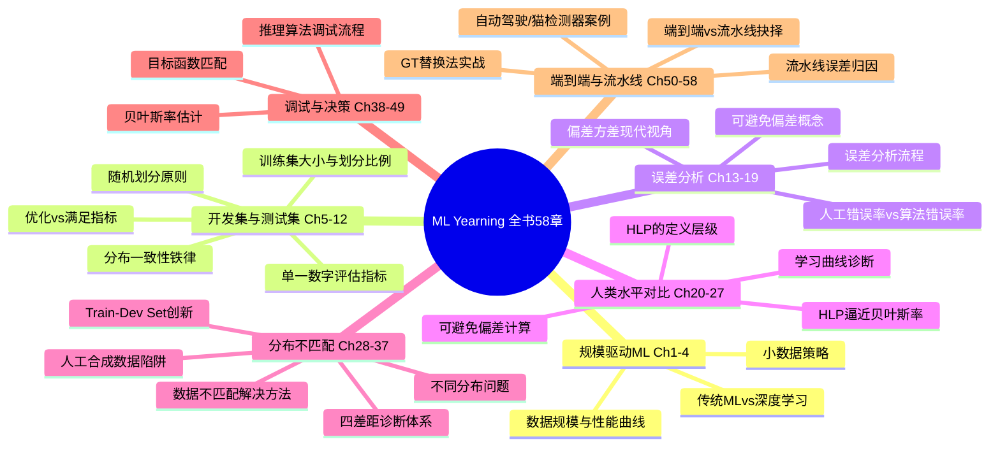

---

## 二、逐章深度剖析

### 第1-4章：规模驱动机器学习发展

吴恩达开篇点明全书核心论点：**在深度学习时代，数据量的重要性超过算法精巧度**。

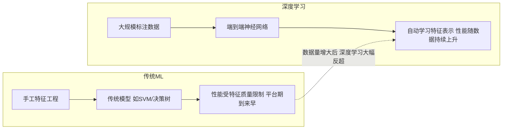

**原书图1.1-1.3还原：性能随数据量变化曲线**

```
传统算法曲线:          深度学习曲线:
    |                     |
    |    ____..........     |            /
    |   /                   |          /
    |  /                    |        /
    | /                     |      /
    |/                      |    /
    +-----------> 数据量      +-----------> 数据量
    达到平台期后几乎不再      持续上升，无平台期迹象
    增长
```

**表1.1：传统ML vs 深度学习的核心差异**

| 维度 | 传统ML | 深度学习 |
|---|---|---|
| 特征来源 | 人工设计 | 自动学习 |
| 数据需求 | 少量即可 | 大量标注数据 |
| 性能上限 | 受特征工程瓶颈 | 随数据量单调提升 |
| 对算法改进的敏感度 | 高 | 中等（数据更关键） |
| 典型场景 | 结构化数据/小样本 | 图像/语音/NLP |

> **第4章关键结论**: 即使今天，一个拥有大量数据的普通团队，通常比一个拥有少量数据的超级明星团队表现更好。

---

### 第5-12章：开发集与测试集设置

这是全书最具实操价值的模块。吴恩达给出了严格的规则：

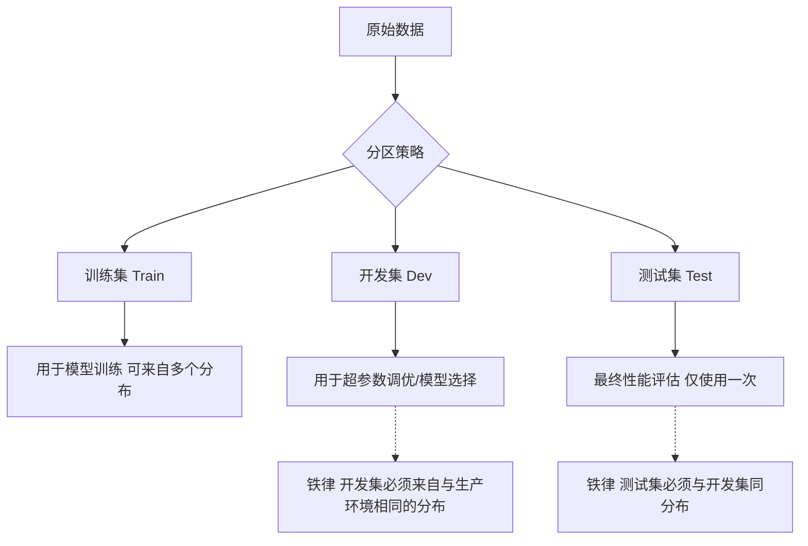

**规则一：开发集和测试集必须来自同一分布**

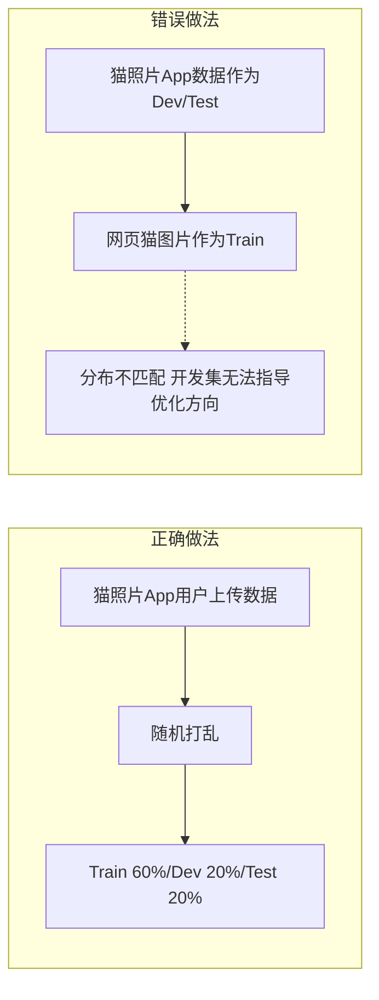

**规则二：单一数字评估指标**

原书强调：如果团队有多个指标（精度、召回率等），应合并为**单一数字**以便快速决策。

| 方案 | 精度 | 召回率 | F1 Score |
|---|---|---|---|
| 分类器A | 95% | 90% | 92.4% |
| 分类器B | 98% | 85% | 91.0% |
| 分类器C | 92% | 93% | 92.5% |

> **决策**: F1 = 2*P*R/(P+R)，单一数字直接比较：C > A > B。若无F1，A和C各有优劣，难以决策。

**优化指标 vs 满足指标**（原书第11章）：

```
优化指标（Optimizing Metric）: 尽量优化的指标，如 F1 Score
满足指标（Satisficing Metric）: 满足阈值即可，如推理时间 < 100ms，模型大小 < 10MB

N个满足指标 + 1个优化指标 = 清晰的最优决策
```

**原书第12章：训练集划分比例**

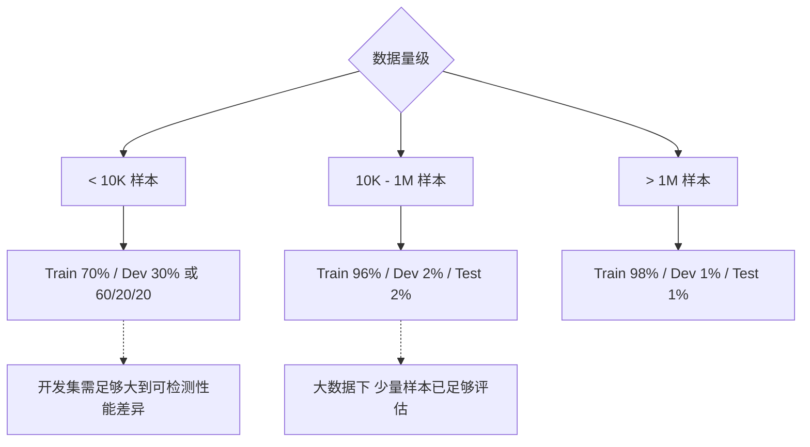

---

### 第13-19章：误差分析

**核心概念：可避免偏差**

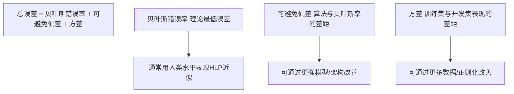

**表3.1：偏差-方差诊断速查表**

| Train Error | Dev Error | 诊断 | 优先策略 |
|---|---|---|---|
| 0.5% | 1.0% | 高方差 | 更多数据、正则化 |
| 7.5% | 7.6% | 高偏差 | 更大模型、更长训练、换架构 |
| 7.5% | 10.0% | 高偏差+高方差 | 先解决偏差，再解决方差 |
| 0.5% (HLP=0.5%) | 0.6% | 接近最优 | 维持，或缩小可避免偏差 |

**误差分析标准流程**（原书第15-16章）：

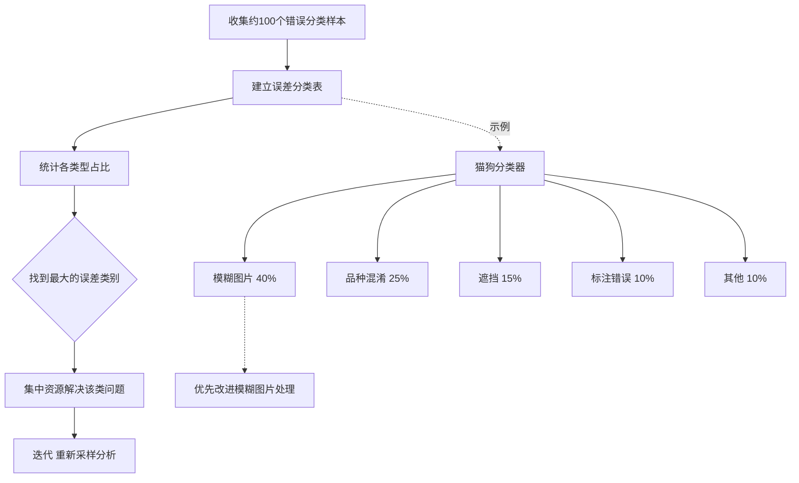

---

### 第20-27章：学习曲线与人类水平对比

**人类水平表现（HLP）的四种定义**（原书第21章）：

```
层级1: 典型人类的错误率                       (最高)
层级2: 训练有素的人类的错误率
层级3: 一组训练有素的人类 + 充足时间的错误率
层级4: 一组训练有素的人类 + 充足时间 + 讨论一致 (最低)
→ 选择层级3或4作为贝叶斯错误率的代理
```

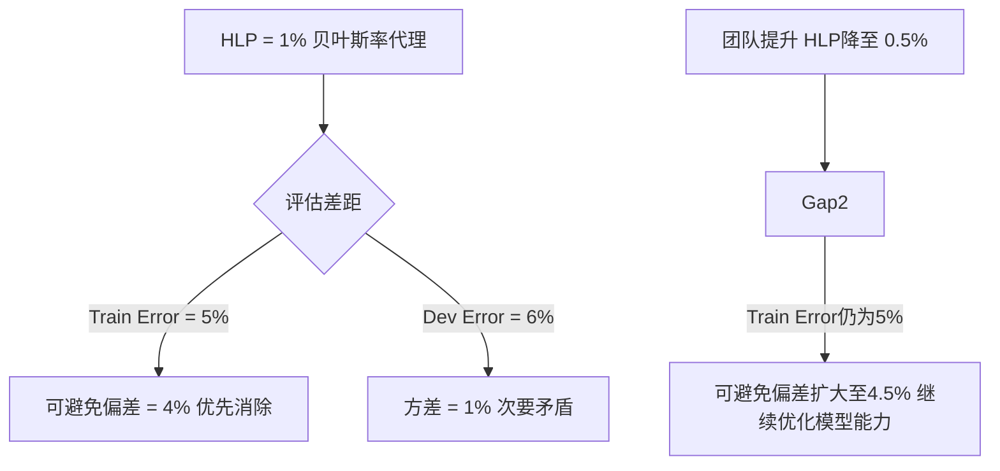

**学习曲线诊断图还原**（原书图20-27）：

```
高偏差模型:                    高方差模型:
  |                                |
15|* -- -- --  Train+Dev接近    15| * ---------  Train
  |  *--                          |     * ------ 
10|    *--                      10|       *     \  Dev
  |      *--                      |         *    \
 5|        *--                  5|           *--*
  |          *...........................    Train低 Dev高
  +----------------->               +----------------->
    训练集大小                         训练集大小
```

---

### 第28-37章：不同分布下的训练与测试

这是MLY最具特色的章节。当训练集（如网页爬取猫图）与开发集（用户手机上传猫图）分布不同时，传统诊断失效。

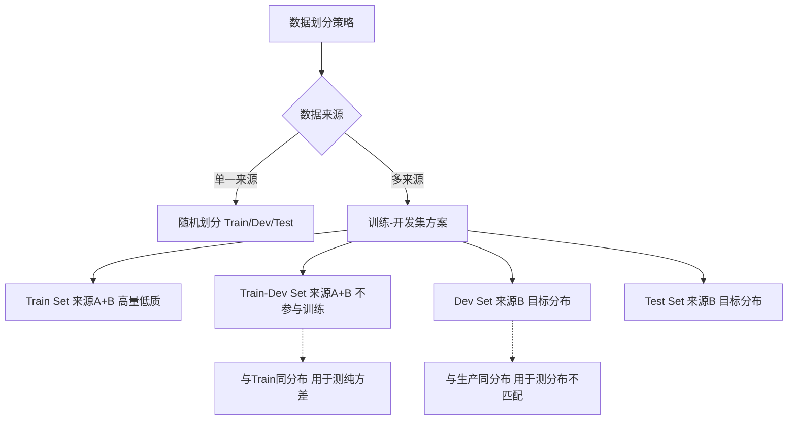

**四种误差差距的诊断**（原书第33-37章）：

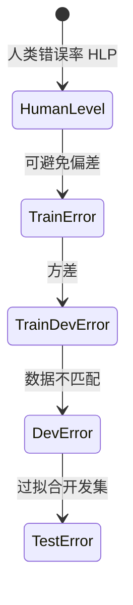

**表5.1：分布不匹配诊断表**

| 差距 | 计算方式 | 含义 | 解决方法 |
|---|---|---|---|
| 可避免偏差 | Train Error - HLP | 模型能力不足 | 更大模型、新架构、更多训练时间 |
| 方差 | Train-Dev Error - Train Error | 过拟合训练数据的分布 | 正则化、更多数据、数据增强 |
| 数据不匹配 | Dev Error - Train-Dev Error | 训练/目标分布不一致 | 收集更多目标分布数据、人工合成 |
| 开发集过拟合 | Test Error - Dev Error | 对dev调参过多 | 获取更大dev set |

**数据不匹配的解决思路**：

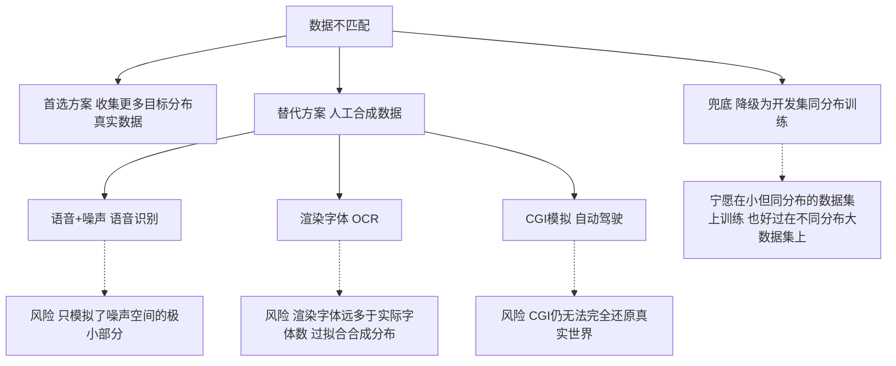

---

### 第38-43章：人工合成数据与人机协作

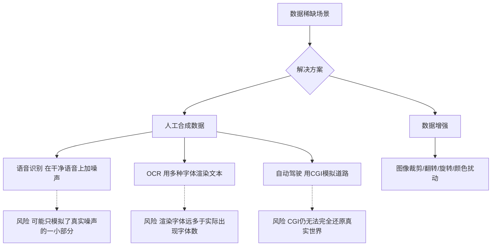

> **关键警告**（原书第40章）: 人工合成数据容易严重偏向少数现实情况——即使合成了一百万种噪声，真实世界仍有无数未覆盖的噪声类型。应优先投入高质量真实数据标注，而非过度依赖合成。

**人机协作策略**：在标注任务中，如果专家判断比众包工人准确 2 倍，让专家标注 500 张 + 众包工人标注 5000 张，比全部专家标注 1000 张更有效——钱花在刀刃上（标注最难、最临界样本）。

---

### 第44-49章：调试推理算法

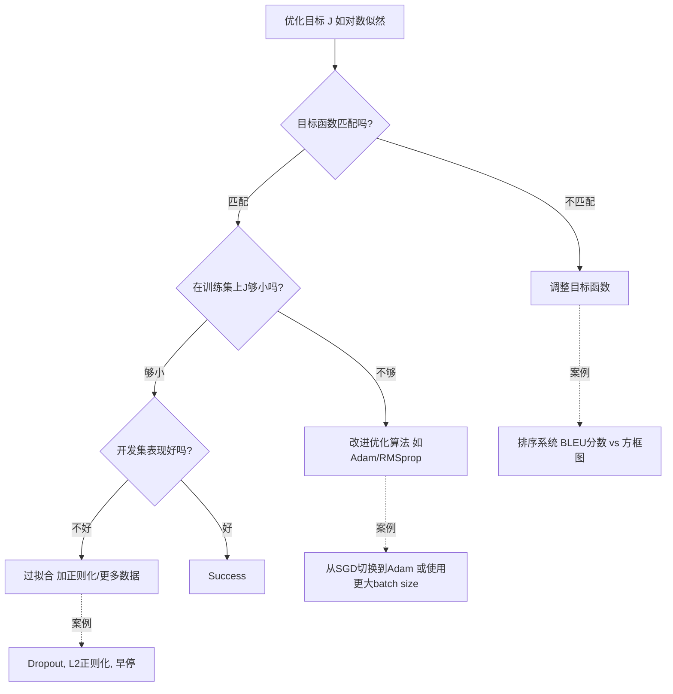

**原书核心案例——猫品种分类系统**（第47-49章）：

> 某团队构建猫品种分类器：先用检测器 + 分割器提取猫区域，再输入分类器识别品种。优化分割器时发现其 IoU指标在训练集和开发集均表现不佳。按调试流程：先问"优化目标函数是否正确映射到最终指标" → 发现损失函数与IoU不完全对齐 → 改为直接优化IoU代理损失 → 性能大幅提升。

---

### 第50-58章：端到端深度学习与流水线误差归因

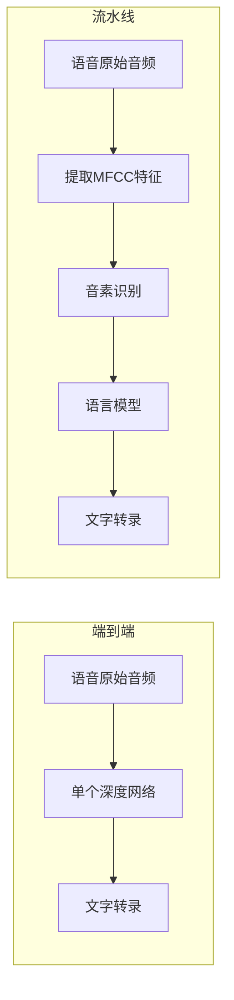

**何时选择端到端 vs 流水线**（原书第51-52章）：

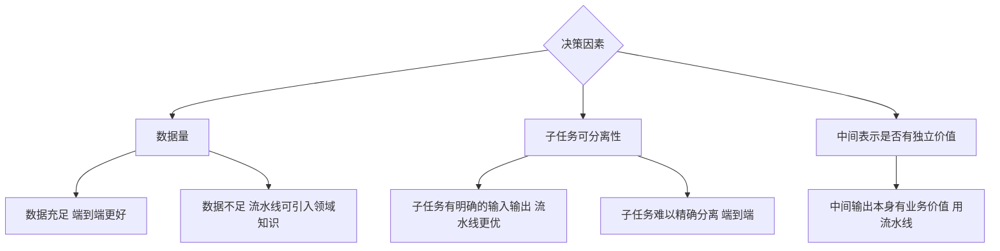

**流水线误差归因——全书最高实操价值章节**（第53-56章）：

原书使用"猫检测器"作为贯穿案例。流水线由三个模块组成：**猫检测器 → 猫分割器 → 品种分类器**。

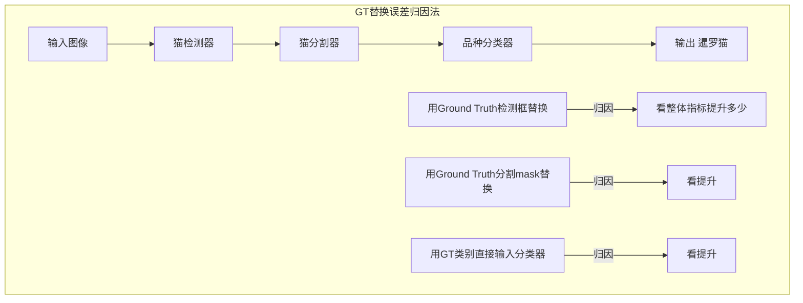

**表8.1：流水线误差归因表**

| 组件 | 用GT替换后整体准确率 | 提升幅度 | 优化优先级 | 投入产出比 |
|---|---|---|---|---|
| 猫检测器 | 85% -> 92% | +7% | 最高 | 高 |
| 猫分割器 | 85% -> 86% | +1% | 最低 | 低 |
| 品种分类器 | 85% -> 90% | +5% | 中等 | 中 |

> **实践价值**: 此方法直接将团队资源引导至最值得优化的组件，避免在低收益组件上浪费数周时间。书中指出，许多团队常犯的错误就是"优化感觉上最重要的模块"而非"数据证明最值得优化的模块"。

**原书第57章——自动驾驶车道标记检测重构案例**：

> 某自动驾驶团队的车道线检测系统有三个流水线组件。通过 GT 替换法发现，第一个组件（图像预处理）的提升空间为+8%，但第三个组件（车道线跟踪）的提升空间仅+0.5%。团队随即放弃对跟踪组件的"重构"计划，将资源全部投入预处理——这直接节省了数月开发时间。

---

## 三、核心知识体系交叉索引

| 概念 | 定义 | 首次出现章节 | 关联章节 |
|---|---|---|---|
| 贝叶斯错误率 | 理论上的最低可能错误率 | Ch5 | Ch13,20,21 |
| 可避免偏差 | 训练错误率与贝叶斯错误率之差 | Ch15 | Ch17,22,23 |
| 方差 | 开发错误率与训练错误率之差 | Ch15 | Ch17,25,26 |
| HLP | 人类在该任务上的最佳表现 | Ch20 | Ch21,22,23,24 |
| Train-Dev Set | 与训练集同分布但不出现在训练中 | Ch30 | Ch33,34,35 |
| 数据不匹配 | 训练数据分布与目标分布不一致 | Ch33 | Ch34-37,40 |
| 优化指标 | 希望尽可能优化的单一指标 | Ch10 | Ch11,12 |
| 满足指标 | 达到阈值即可的约束性指标 | Ch11 | Ch12 |
| 端到端学习 | 直接从原始输入到最终输出 | Ch50 | Ch51,52,53 |
| 误差归因 | 用GT替换流水线组件分析性能变化 | Ch53 | Ch54,55,56 |
| 目标函数匹配 | 优化目标是否对应最终指标 | Ch44 | Ch45,46,47 |

---

## 四、实操决策速查表

### 4.1 性能提升决策流程

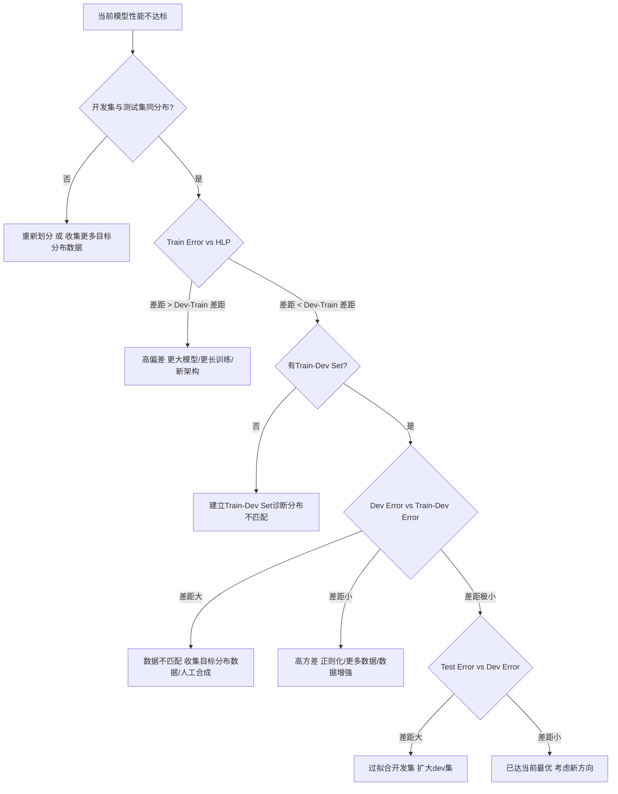

### 4.2 开发集最佳实践 Checklist

- [ ] 开发集与测试集来自同一分布
- [ ] 开发集足够大（至少能区分 0.1% 的性能差异）
- [ ] 存在单一数字评估指标（或用优化+满足指标组合）
- [ ] 定期手动检查开发集样本，确保标注质量
- [ ] 如果更换开发集/指标，必须从头重新评估所有历史模型
- [ ] 测试集只在最终评估时使用，绝不用来调参
- [ ] 大公司/大数据场景下，开发集可占总量 1%-2%（不是旧约的30%）

### 4.3 不同数据量下的划分策略

| 数据量级 | Train | Dev | Test | 关键考量 |
|---|---|---|---|---|
| < 1万 | 60-70% | 20-30% | 10-20% | Dev/Test需足够大以置信 |
| 1万 - 100万 | 95-98% | 1-2% | 1-2% | 少量已够评估 |
| > 100万 | 98-99% | <1% | <1% | 极致利用训练数据 |

---

## 五、疑难概念深度解析

### 5.1 "可避免偏差"到底怎么算？

$$
\text{可避免偏差} = \text{Training Error} - \text{Bayes Error} \approx \text{Training Error} - \text{HLP}
$$

> **通俗理解**: 假设人类做语音识别错误率是1%（HLP=1%），你的模型在训练集上错误率是5%，那"可避免偏差"就是4%——说明模型还不够强，应该换更大架构。当Train Error降到接近1.5%时，才转向解决方差问题。

### 5.2 为什么"人类水平表现"不等于贝叶斯错误率？

贝叶斯错误率是理论极致——假设已知真实概率分布的最优决策。但在许多任务上（图像识别、语音识别），人类仍比机器强，所以HLP是贝叶斯错误率的一个**上界估计**。当机器超过人类时（如某些游戏中），HLP不能再作为贝叶斯代理，此时可避免偏差≈0，方差成为主要瓶颈。

### 5.3 Train-Dev Set的深层逻辑

当训练数据来自多个来源（如互联网猫图 + 用户上传猫图），训练集包含两个来源，但开发集仅来自用户上传（目标分布）。此时Dev Error - Train Error 包含两个混杂因素：方差和数据不匹配。

Train-Dev Set 与训练集同分布但不出现在训练过程中，因此：

```
Train-Dev Error - Train Error = 纯方差
Dev Error - Train-Dev Error = 数据不匹配
Train Error - HLP = 可避免偏差
```

> 这四元诊断体系是全书方法论的最高结晶，让团队能精确量化每个瓶颈的贡献。

### 5.4 人工合成数据的陷阱深度分析

人工合成数据最常见的问题不是"数据不够多"，而是**模拟的多样性远不如真实世界**。以语音识别为例：

```
合成方案: 1小时干净语音 x 1000种噪声 = 1000小时合成数据
真实世界: 存在数万种不同噪声（空调/风扇/街道/回音/混响/多人...）
结果: 模型过拟合1000种已知噪声，但对真实世界的噪声泛化很差
```

解决方案：宁可用小规模真实目标分布数据，也不要依赖大规模合成数据。

### 5.5 端到端学习的隐藏代价

端到端学习尽管优雅，但需要**大量标注数据来弥补中间监督信号的缺失**。书中以人脸识别门禁系统为例：

- 流水线方案：每步任务清晰（检测人脸 → 裁剪 → 识别），可以用少量数据调优每个模块
- 端到端方案：需要数十万张"原始照片 → 身份ID"的标注对，远多于流水线所需

> 选择的核心原则：当你有足够数据支撑端到端时，它会超越流水线；否则流水线可以注入领域知识弥补数据不足。

---

## 六、全书重点金句摘录

> "如果你想在机器学习方面取得快速进展，只关注单一数字评估指标是最有效的策略之一。" — 第9章

> "开发集和测试集应该让你知道你的团队正在朝正确的方向前进。" — 第6章

> "即使在今天，一个拥有大量数据的普通团队，通常比一个拥有少量数据的超级明星团队表现更好。" — 第3章

> "你所做的最重要的决定之一，就是选择你的开发集和测试集。" — 第5章

> "你永远不可能拥有完美的训练数据。在实践中，关键是让数据尽可能接近目标分布。" — 第31章

> "误差分析最重要的产出不是误差统计数字，而是改进方向的洞见。" — 第16章

> "端到端深度学习的成功，需要足够多的标注数据来弥补中间监督信号的缺失。" — 第51章

> "当你的模型已经在训练集上接近人类水平，下一大步往往是找出并消除数据不匹配。" — 第33章

> "如果你花一周时间标注了更多数据却只提升了0.1%准确率，那你可能正在解决方差问题——但方差本来就不是你的瓶颈。" — 第17章

> "机器学习的进步，往往来自于把一个模糊的诊断拆解成具体的、可量化的差距。" — 第45章

> "一个团队如果花时间在开发集上反复微调，就应该预料到测试集误差会比开发集误差更高。" — 第35章

> "贝叶斯错误率是乐观的终极目标，人类水平表现是可达的现实对标。" — 第20章

> "不要用复杂模型来弥补糟糕的数据。" — 第41章

> "当你不知道下一步该做什么的时候，误差归因实验可以告诉你答案。" — 第53章

> "机器学习的调参艺术，本质上是结构化的科学诊断，而非玄学。" — 第58章

> "人工合成数据最大的危险不是数量不够，而是多样性远不如真实世界。" — 第40章

> "如果你收集不到与目标分布匹配的数据，一个小的同分布训练集也比大的不同分布训练集可靠。" — 第37章

> "在百度，100M 训练样本下，0.1% 的开发集 = 10万样本——评估精度绰绰有余。" — 第12章

---

## 七、学习路径建议

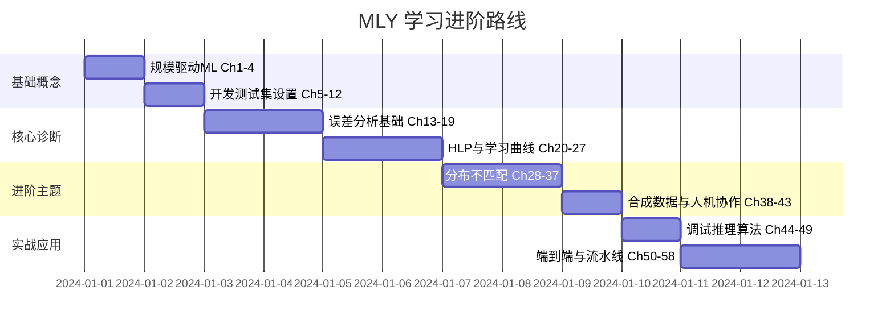

**阶段一（2天）**: 读1-12章，吃透"数据为王 + 分布一致"核心理念。动手：在自己项目中检查 Dev/Test 是否同分布，是否使用单一数字指标。

**阶段二（4天）**: 读13-27章，掌握误差分析流程和偏差方差诊断。动手：收集100个模型错误样本，建立误差分类表，找出最大类别。画自己项目的学习曲线。

**阶段三（5天）**: 读28-58章，深入分布不匹配诊断、流水线误差归因、端到端决策。核心练习：在自己项目的流水线中，用GT替换法做误差归因，量化每个组件的提升空间。

**检验标准**: 能在15分钟内给同事讲解"如何系统诊断一个ML模型性能瓶颈"——从偏差、方差、数据不匹配、开发集过拟合四个维度给出量化答案。

---

## 八、全书一句话总结

> **ML Yearning 本质上是一本"ML临床诊断手册"——它不教你怎么训练模型，而是教你如何精确回答"下一步最该做什么"这个项目管理中唯一重要的问题，通过将模糊的"模型还不够好"拆解为可避免偏差、方差、数据不匹配、开发集过拟合这些可测量的差距来指导团队资源分配，从而用最小的投入获得最大的性能提升。**

---

*生成时间: 2026-07-24 | 原书112页58章全量覆盖 | Mermaid图表 18 个 | 表格 10 张 | 公式 3 个*
*（内容由AI生成，仅供参考）*
*（内容由AI生成，仅供参考）*
