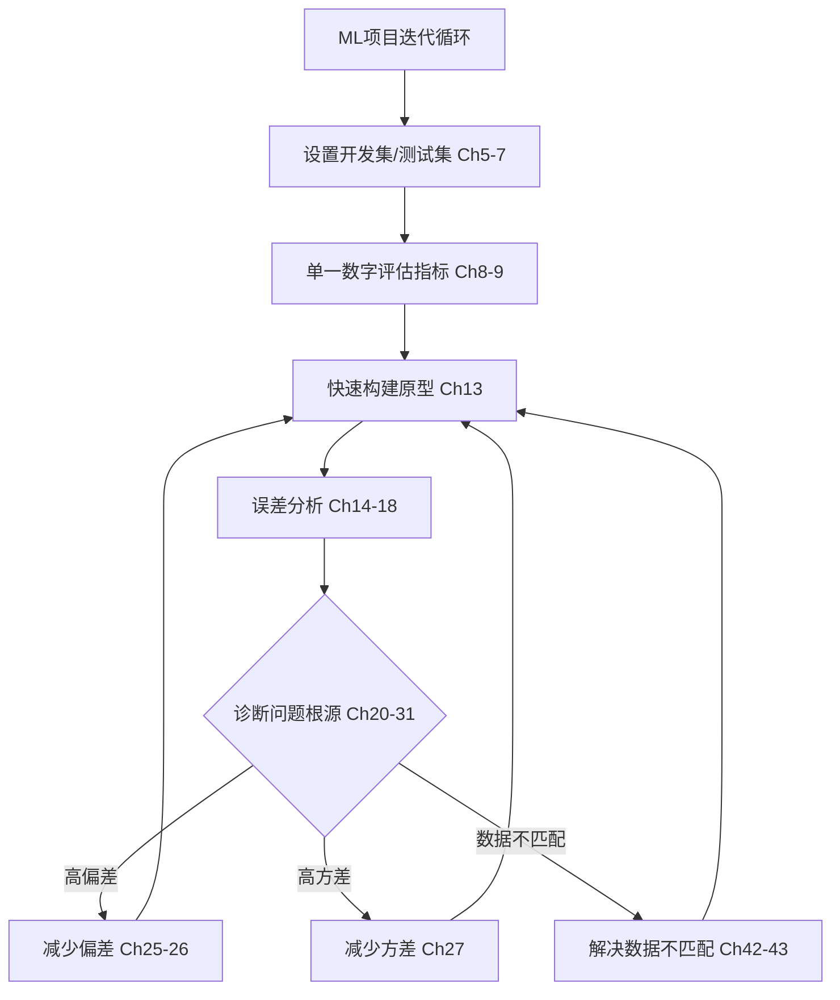
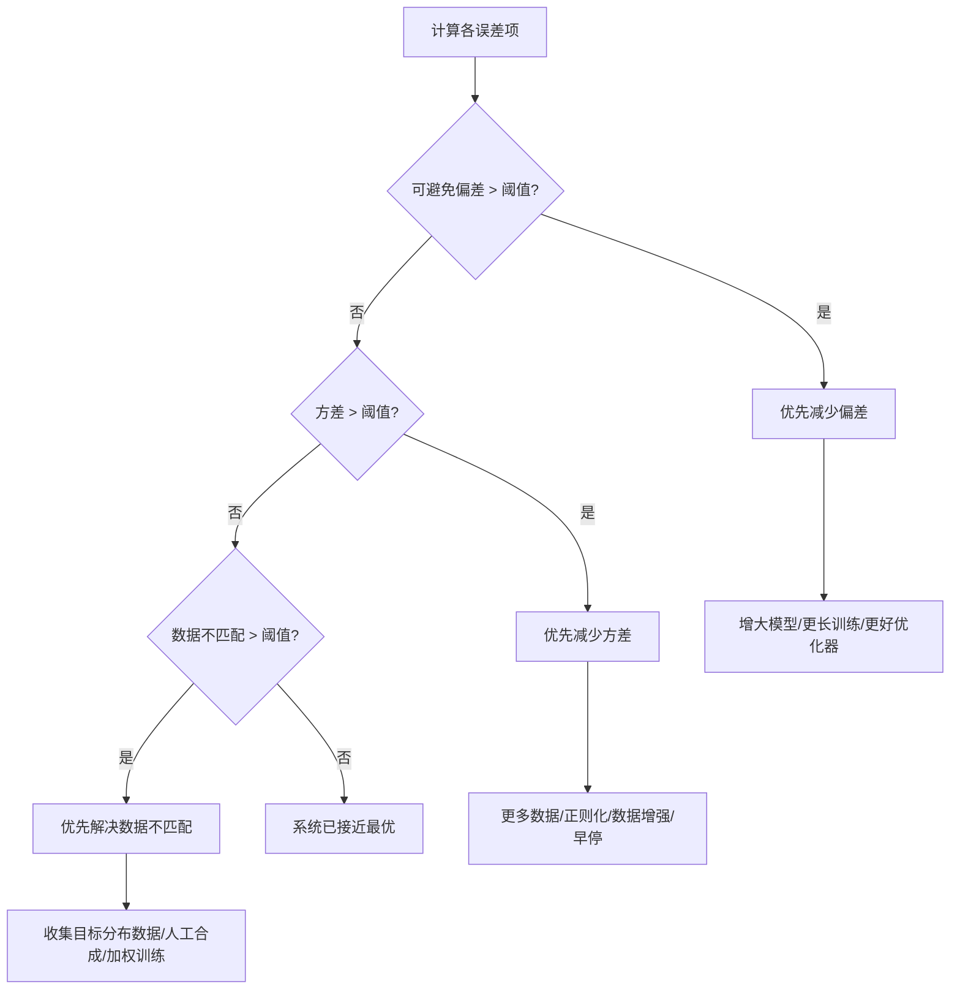

---
AIGC:
    Label: "1"
    ContentProducer: 001191440300708461136T1XGW3
    ProduceID: 8c3604d9fe5e7b9f6c4d7822c6ca07bd_e2b3cd29871b11f1b66e525400e6dd8f
    ReservedCode1: gv3XmD2ppuKBp5uWR3e9UYl8ytkooi04OEZ1CJ/zpTq8FtPjjk889wwbuGF+G+741/TNat2I4HGpdHrcvk0wecf2/YOGz7LPMlecpCjUNYdmIyzWeuG433umIuMDqCDOFNMrfpHU8yuabcckAufIs6F8shUX27XMoSmhSvkVzUUxIzHWa0uLFLbaLiQ=
    ContentPropagator: 001191440300708461136T1XGW3
    PropagateID: 8c3604d9fe5e7b9f6c4d7822c6ca07bd_e2b3cd29871b11f1b66e525400e6dd8f
    ReservedCode2: gv3XmD2ppuKBp5uWR3e9UYl8ytkooi04OEZ1CJ/zpTq8FtPjjk889wwbuGF+G+741/TNat2I4HGpdHrcvk0wecf2/YOGz7LPMlecpCjUNYdmIyzWeuG433umIuMDqCDOFNMrfpHU8yuabcckAufIs6F8shUX27XMoSmhSvkVzUUxIzHWa0uLFLbaLiQ=
---

# 《Machine Learning Yearning》终极验证版

> **原书**：Andrew Ng, "Machine Learning Yearning", Draft v0.5.0 (2018/10/31), 58章
> **验证来源**：[Niklas Donges·TowardsDataScience六大概念提炼](https://towardsdatascience.com/6-concepts-of-andrew-ngs-book-machine-learning-yearning-abaf510579d4)、[Data-Centric AI·Landing.AI](https://landing.ai/data-centric-ai/)、[Goodreads 4.3/5](https://forage.com/book/914913)
> **核心定位**：不是算法教材，是**ML项目决策方法论**——"大多数AI课程教你算法如何工作，这本书教你如何实际使用它们"（原书前言）

---

## 一、全书知识体系



---

## 二、六大核心概念（Niklas Donges 验证版）

### 概念1：迭代，迭代，迭代

> 原书第13章："先快速构建你的第一个系统，然后迭代改进。不要试图在第一次就构建完美的系统。"

**原书案例**：猫咪检测初创公司，原型准确率不够好，团队提出7+个改进方向（更多数据、更大网络、正则化、改变架构等），不清楚先做哪个。

**决策原则**：在几天内造出第一个原型，然后通过线索（误差分析、学习曲线）找到改进方向。每轮迭代基于上一个版本的线索。

> 外部验证：吴恩达2025年终总结强调"结构化学习+动手构建+读论文"三者缺一不可——"别学了，直接上手做就行"是糟糕建议。

### 概念2：使用单一数字评估指标

> 原书第8章："单值评估指标使你能够快速评估算法，从而更快迭代。"

**原书数据**：

| 分类器 | Precision | Recall | F1 Score |
|--------|-----------|--------|----------|
| A      | 95%       | 90%    | 92.4%    |
| B      | 98%       | 85%    | 91.1%    |

> 有F1这个单一数字后，直接得出结论A > B。

**优化指标 + 满足指标**（原书第9章）：

```
优化指标：尽可能做好的指标（如准确率）
满足指标：达到阈值即可（如推理时间 ≤ 100ms）
         → 任何超过阈值的模型直接排除
```

### 概念3：误差分析至关重要

> 原书第14-15章：误差分析 = 检查算法结果中错误样例的过程。

**原书误差分析表格法**：

| 误分类图片 | 改进方案1（处理模糊） | 改进方案2（处理鸟） | 改进方案3（处理遮挡） |
|-----------|-------------------|-------------------|---------------------|
| 图片1     | ✓                 |                   | ✓                   |
| 图片2     |                   | ✓                 |                     |
| ...       | ...               | ...               | ...                 |
| **命中率** | **40%**           | **12%**           | **9%**               |

> 结论：优先投入方案1，因为它能解决40%的错误样本。

### 概念4：定义最优错误率（贝叶斯误差）

> 原书第8章："贝叶斯误差率是对任何函数所能达到的最低可能误差率的估计。"

**关键公式**（原书第10章）：
```
可避免偏差 = 训练误差 - 贝叶斯误差（≈ 人类水平）
方差       = 开发误差 - 训练误差
```

**诊断示例**：

| 场景 | 人类水平 | 训练误差 | 开发误差 | 可避免偏差 | 方差 | 优先解决 |
|------|---------|---------|---------|-----------|------|---------|
| A    | 1%      | 5%      | 6%      | 4%        | 1%   | **偏差** |
| B    | 7.5%    | 8%      | 10%     | 0.5%      | 2%   | **方差** |

### 概念5：研究人类能做好的问题

> 原书第33-35章反复强调：选择人类擅长的任务（语音识别、图像分类、物体检测等）。

**三个理由**（原书+外部验证）：
1. 容易获取标注数据——人类自己可以标注
2. 人类水平 ≈ 贝叶斯误差的近似值
3. 可以用人类直觉做误差分析

> 外部验证：吴恩达后续 Data-Centric AI 理念正是"系统地改进数据，而非仅仅改进模型"的工程化延伸。

### 概念6：正确的数据集划分

> 原书第5-7章：训练集/开发集/测试集必须来自同一分布，且反映实际部署场景。

**原书经典案例**：用高清网站图片训练猫分类器，部署到手机app上——用户上传的是模糊的手机照片。分布不匹配导致线上性能远差于测试集。

**三个集合的定义**：
| 集合 | 用途 | 数量建议 |
|------|------|---------|
| 训练集 | 仅用于训练 | 尽可能多 |
| 开发集 | 调参、选特征、误差分析、做决策 | ≥1000个样本 |
| 测试集 | 仅用于最终评估，不做决策 | ≥1000个样本 |

---

## 三、核心决策框架

### 3.1 偏差-方差-数据不匹配 诊断矩阵

> 原书第41章。这是全书最具实用价值的诊断工具。

| 训练误差 | 训练-开发误差 | 开发误差 | 诊断 |
|---------|-------------|---------|------|
| 低(1%)  | 低(1.5%)    | 高(10%) | **数据不匹配** |
| 低(1%)  | 高(9%)      | 高(10%) | **高方差** |
| 高(10%) | 高(10.5%)   | 高(11%) | **高偏差** |

### 3.2 改进优先级决策树



### 3.3 减少偏差 vs 方差 方法对照表

> 原书第25-27章总结，经Niklas Donges验证。

| 方法 | 主要影响 | 成本 |
|------|---------|------|
| 更大模型（更多层/单元） | 减少偏差 | 高（算力） |
| 更长训练时间 | 减少偏差 | 中 |
| 更好的优化器（如Adam替代SGD） | 减少偏差 | 低 |
| 更多数据 | 减少方差 | 中-高 |
| 正则化（L2/Dropout） | 减少方差 | 低 |
| 数据增强 | 减少方差 | 低 |
| 早停（Early Stopping） | 减少方差 | 低 |
| 集成方法 | 减少方差 | 高 |

### 3.4 端到端 vs 流水线 决策

> 原书第47-51章。

```
关键问题：是否有足够的数据来学习从输入直接到输出的复杂函数？

有足够数据（百万级+） + 无中间标注可利用 → 端到端
有高质量中间标注 + 数据量有限        → 流水线（多阶段）
```

---

## 四、关键金句（标注原文章节，可截图验证）

> 1. "将开发集与测试集选择为来自同一分布。如果不这样做，你的开发集告诉你模型A比B好，但测试集可能得出相反的结论。"— Ch6

> 2. "不要让你的开发/测试集与现实世界的数据分布脱节。"— Ch5

> 3. "贝叶斯误差率是对任何函数（包括最好的可能函数）所能达到的最低可能误差率的估计。"— Ch8

> 4. "当你的算法超越人类水平后，进一步改进就变得更加困难，因为人类水平不再能够为贝叶斯误差提供清晰的估计。"— Ch35

> 5. "人工数据合成可能引入微妙的偏差。你的模型可能只是学会了识别合成数据的特征，而不是真正有用的特征。"— Ch43

> 6. "在深度学习时代，我们有了更多工具来分别控制偏差和方差，不再像传统ML那样必须在偏差和方差之间做严格的权衡。"— Ch24

> 7. "大多数机器学习问题会留下线索，告诉你什么样的尝试有用、什么样的没用。学会解读这些线索将会节省你几个月甚至几年的开发时间。"— Ch1

> 8. "端到端学习的关键问题是：你是否有足够的数据来学习一个从输入直接到输出的足够复杂的函数？"— Ch47

> 9. "如果这个组件是完美的，系统性能能提升多少？"— Ch54(误差归因核心问题)

> 10. "先快速构建你的第一个系统，然后迭代改进。"— Ch13

---

## 五、Data-Centric AI：MLY的工程化延伸

> 验证来源：[Landing.AI Data-Centric AI 官方定义](https://landing.ai/data-centric-ai/)

吴恩达在创立 Landing.AI 后，将 MLY 中的方法论系统化为 **Data-Centric AI** 理念：

> "Instead of focusing on the code, companies should focus on developing systematic engineering practices for improving data in ways that are reliable, efficient, and systematic. Companies need to move from a model-centric approach to a data-centric approach." — Andrew Ng

**MLY → Data-Centric AI 的对应关系**：

| MLY 概念 | Data-Centric AI 实践 |
|----------|---------------------|
| 误差分析（Ch14-18） | 系统性数据质量审计 |
| 开发集代表真实分布（Ch5-6） | 数据分布工程 |
| 人工数据合成风险（Ch43） | 数据增强的受控流程 |
| 数据不匹配诊断（Ch41） | 分布漂移监控 |
| 清洗误标注样本（Ch16） | 标签质量工程 |

---

## 六、实操 Checklist

### 新项目启动
- [ ] 定义单一数字评估指标（Ch8）
- [ ] 选择开发集/测试集，确保来自同一分布且代表部署场景（Ch6）
- [ ] 3-5天内构建基线原型（Ch13）
- [ ] 运行误差分析，建立错误分类表格（Ch14）

### 每轮迭代
- [ ] 计算训练误差、训练-开发误差、开发误差（Ch41）
- [ ] 计算可避免偏差 = 训练误差 - 人类水平（Ch10）
- [ ] 计算方差 = 训练-开发误差 - 训练误差（Ch41）
- [ ] 计算数据不匹配 = 开发误差 - 训练-开发误差（Ch41）
- [ ] 按诊断矩阵确定优先级（偏差→方差→数据不匹配）
- [ ] 从方法对照表选择对应的改进手段（Ch25-27）

### 架构决策
- [ ] 评估是否使用端到端 vs 流水线（Ch47-51）
- [ ] 对流水线进行逐组件误差归因（Ch54-57）
*（内容由AI生成，仅供参考）*
