---
AIGC:
    Label: "1"
    ContentProducer: 001191440300708461136T1XGW3
    ProduceID: 8c3604d9fe5e7b9f6c4d7822c6ca07bd_da3ef7d1870e11f1b66e525400e6dd8f
    ReservedCode1: c44eirPiPkF35gVxA0IihmtHA0B+rAB/I76eFfa6/rHvZBeK2HKeNiIdUnz+FmWDVe8vkTr9Wq4wJN2wP/cw5g4NB5aCnodNXPHzhG2/nJuQmmvpkT/1vekrr4xz/oBqn3pp8awtF5SxISm5UAqFJz5AkYqRlcQHDKBcGUX0rcB3AAJzDoJOMp278Lk=
    ContentPropagator: 001191440300708461136T1XGW3
    PropagateID: 8c3604d9fe5e7b9f6c4d7822c6ca07bd_da3ef7d1870e11f1b66e525400e6dd8f
    ReservedCode2: c44eirPiPkF35gVxA0IihmtHA0B+rAB/I76eFfa6/rHvZBeK2HKeNiIdUnz+FmWDVe8vkTr9Wq4wJN2wP/cw5g4NB5aCnodNXPHzhG2/nJuQmmvpkT/1vekrr4xz/oBqn3pp8awtF5SxISm5UAqFJz5AkYqRlcQHDKBcGUX0rcB3AAJzDoJOMp278Lk=
---

# 《大模型基础》浙江大学 — 图文深度总结

> **原书**: 毛玉仁 等，《大模型基础》(大模型基础.pdf, 290页, 6章)
> **定位**: 系统性的大语言模型（LLM）教材，从语言模型基础到 Prompt 工程、参数高效微调、模型编辑、检索增强生成的完整技术栈
> **贯穿案例**: 全书以"考拉 / 树袋熊 / 袋熊"为经典示例贯穿各章，形象生动

---

## 一、全书知识体系总览

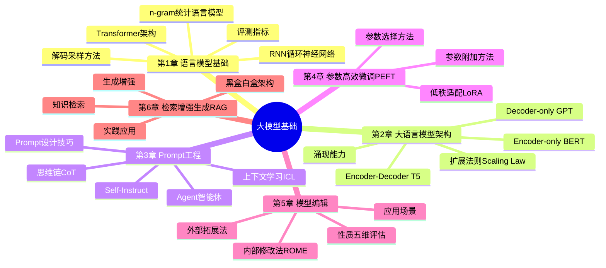

---

## 二、第1章 语言模型基础

### 2.1 语言模型发展脉络

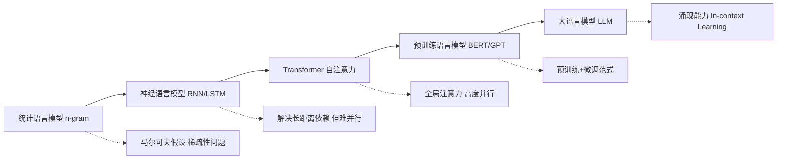

### 2.2 n-gram 语言模型

n-gram 基于**马尔可夫假设**：一个词的出现概率只依赖于前 n-1 个词。

$$
P(w_1, w_2, ..., w_m) = \prod_{i=1}^{m} P(w_i | w_{i-n+1}, ..., w_{i-1})
$$

以 bigram（2-gram）为例：

$$
P(w_i | w_{i-1}) = \frac{\text{count}(w_{i-1}, w_i)}{\text{count}(w_{i-1})}
$$

**表1.1：n-gram 模型的权衡**

| n值 | 上下文长度 | 优点 | 缺点 |
|---|---|---|---|
| 1 (unigram) | 无上下文 | 参数最少 | 完全忽略词序 |
| 2 (bigram) | 前1词 | 简单有效 | 上下文极短 |
| 3 (trigram) | 前2词 | 常用平衡点 | 数据稀疏加剧 |
| n>=4 | 前n-1词 | 上下文更长 | 稀疏性/存储爆炸 |

> **核心问题**: 数据稀疏性——大量 n-gram 组合在语料中从未出现，需要平滑技术（如拉普拉斯平滑、回退法）缓解。

### 2.3 RNN 循环神经网络

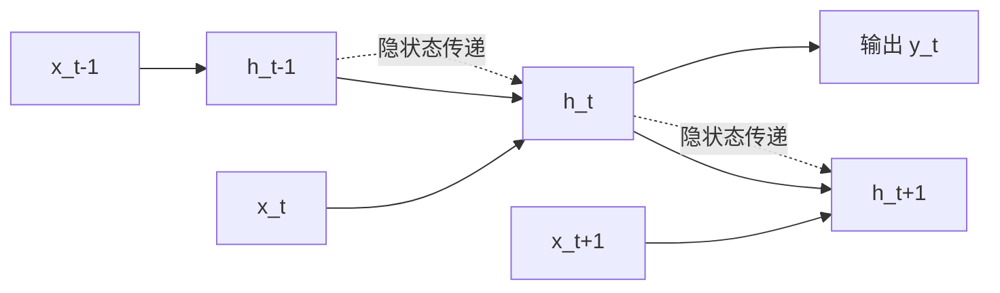

隐状态更新公式：

$$
h_t = \tanh(W_{hh} h_{t-1} + W_{xh} x_t + b_h)
$$

> **RNN 的痛点**: 梯度消失/爆炸导致难以捕捉长距离依赖；序列计算无法并行。LSTM/GRU 通过门控机制缓解，但并行问题仍存在。

### 2.4 Transformer 架构（原书核心图）

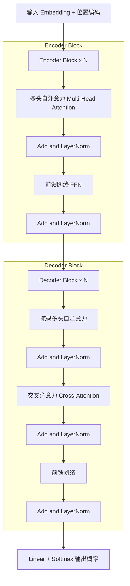

**自注意力机制核心公式**：

$$
\text{Attention}(Q, K, V) = \text{softmax}\left(\frac{QK^T}{\sqrt{d_k}}\right)V
$$

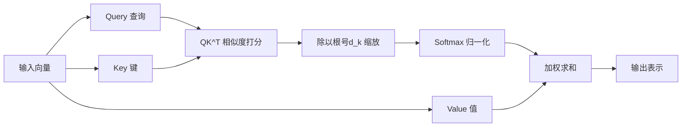

**表1.2：三种架构组件对比**

| 组件 | 作用 | 关键特性 |
|---|---|---|
| 多头注意力 | 从多个子空间捕捉不同关系 | 并行 h 个注意力头 |
| 位置编码 | 注入序列位置信息 | 正弦/可学习编码 |
| 前馈网络(FFN) | 逐位置非线性变换 | 通常含两层+激活 |
| 残差连接 | 缓解梯度消失 | Add and LayerNorm |

### 2.5 解码采样策略

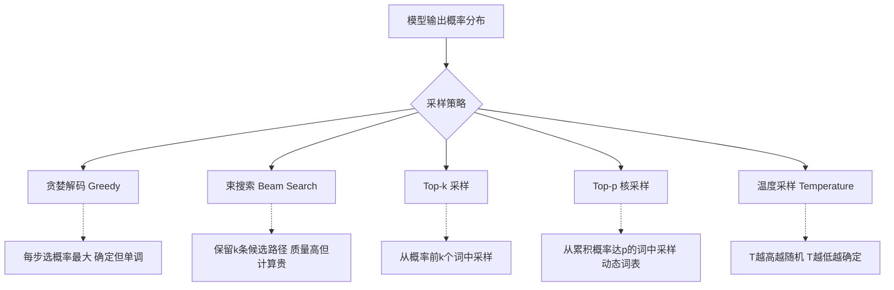

**温度采样公式**：

$$
P(w_i) = \frac{\exp(z_i / T)}{\sum_j \exp(z_j / T)}
$$

**表1.3：采样策略对比**

| 策略 | 多样性 | 确定性 | 典型场景 |
|---|---|---|---|
| 贪婪解码 | 最低 | 最高 | 事实问答 |
| 束搜索 | 低 | 高 | 机器翻译 |
| Top-k | 中 | 中 | 开放生成 |
| Top-p (核采样) | 中高 | 中 | 对话/创作 |
| 高温度采样 | 最高 | 最低 | 创意写作 |

### 2.6 语言模型评测

**困惑度（Perplexity）** 是内在评测的核心指标：

$$
\text{PPL}(W) = P(w_1 w_2 ... w_N)^{-\frac{1}{N}} = \sqrt[N]{\prod_{i=1}^{N}\frac{1}{P(w_i|w_1...w_{i-1})}}
$$

> 困惑度越低，模型对测试语料的预测越准确。此外还有 BLEU（翻译）、ROUGE（摘要）、下游任务准确率等外在评测。

---

## 三、第2章 大语言模型架构

### 3.1 三种主流架构对比

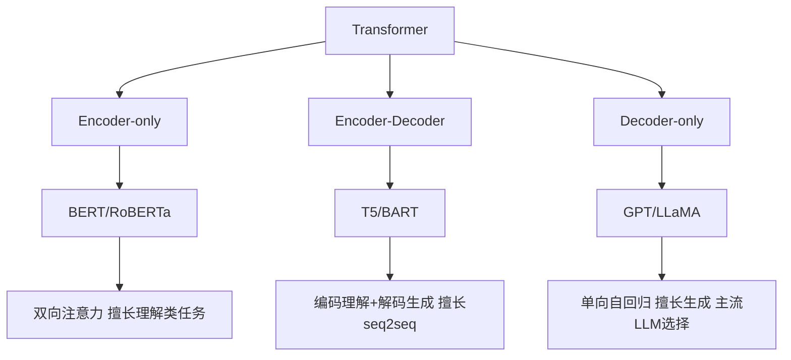

**表2.1：三种架构详细对比**

| 维度 | Encoder-only | Encoder-Decoder | Decoder-only |
|---|---|---|---|
| 代表模型 | BERT | T5, BART | GPT, LLaMA |
| 注意力方式 | 双向 | 编码双向+解码单向 | 单向(因果) |
| 预训练任务 | 掩码语言建模MLM | 去噪/Span掩码 | 自回归语言建模 |
| 擅长任务 | 分类/NER/理解 | 翻译/摘要 | 开放生成/对话 |
| 主流LLM选择 | 否 | 部分 | 是（GPT系列主导） |

### 3.2 扩展法则（Scaling Law）

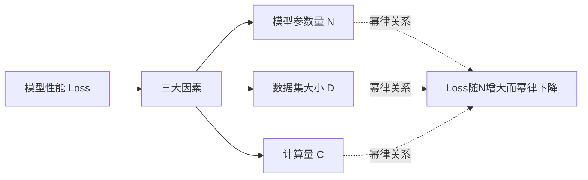

扩展法则揭示：模型损失与参数量、数据量、计算量呈**幂律关系**：

$$
L(N) \approx \left(\frac{N_c}{N}\right)^{\alpha_N}, \quad L(D) \approx \left(\frac{D_c}{D}\right)^{\alpha_D}
$$

> **实践意义**: 给定计算预算，扩展法则可指导如何最优分配参数量与数据量（Chinchilla 法则指出应同比例增长）。

### 3.3 涌现能力（Emergent Abilities）

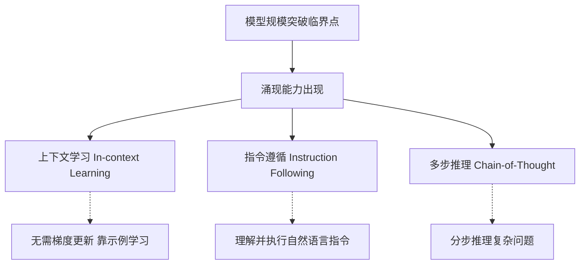

> **涌现的核心特征**: 当模型规模小于某临界值时，某些能力几乎为零；一旦超过临界规模，能力突然大幅提升——呈现"相变"式的非线性跃升，无法通过小模型的表现外推预测。

---

## 四、第3章 Prompt 工程

### 4.1 Prompt 工程知识体系

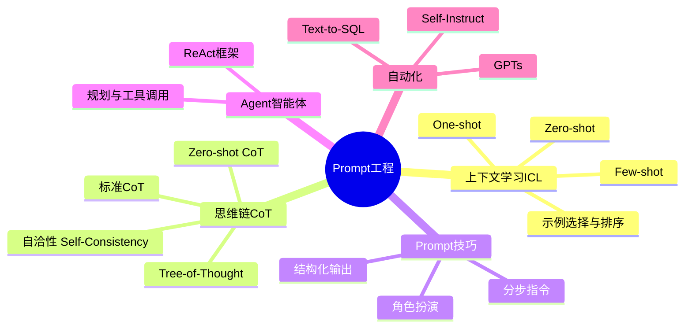

### 4.2 上下文学习（In-Context Learning, ICL）

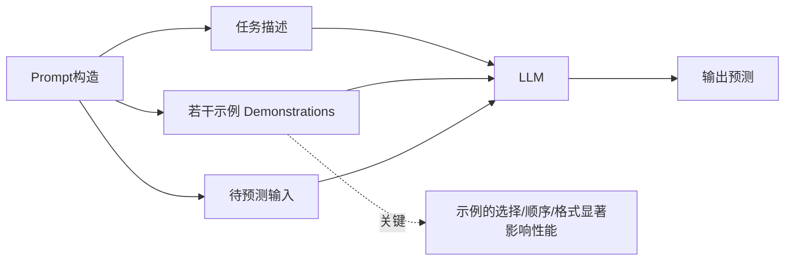

**表3.1：ICL 的三种模式**

| 模式 | 示例数量 | 特点 |
|---|---|---|
| Zero-shot | 0 | 仅任务描述，靠模型内在知识 |
| One-shot | 1 | 单个示例引导格式 |
| Few-shot | 少量(2-32) | 多示例，性能通常最佳 |

### 4.3 思维链（Chain-of-Thought, CoT）演进

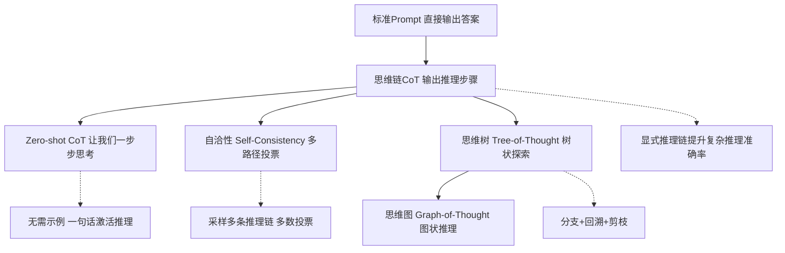

**Zero-shot CoT 的魔法咒语**: 在问题后加上 "Let's think step by step"（让我们一步步思考），即可显著提升推理表现。

**表3.2：CoT 变体对比**

| 方法 | 核心思想 | 适用场景 |
|---|---|---|
| 标准CoT | 提供带推理步骤的示例 | 数学/逻辑推理 |
| Zero-shot CoT | 用咒语触发推理，无需示例 | 快速部署 |
| Self-Consistency | 多次采样推理链，投票选答案 | 高准确率要求 |
| Tree-of-Thought | 树状探索多个推理分支 | 需要规划/搜索的问题 |

### 4.4 Agent 智能体框架

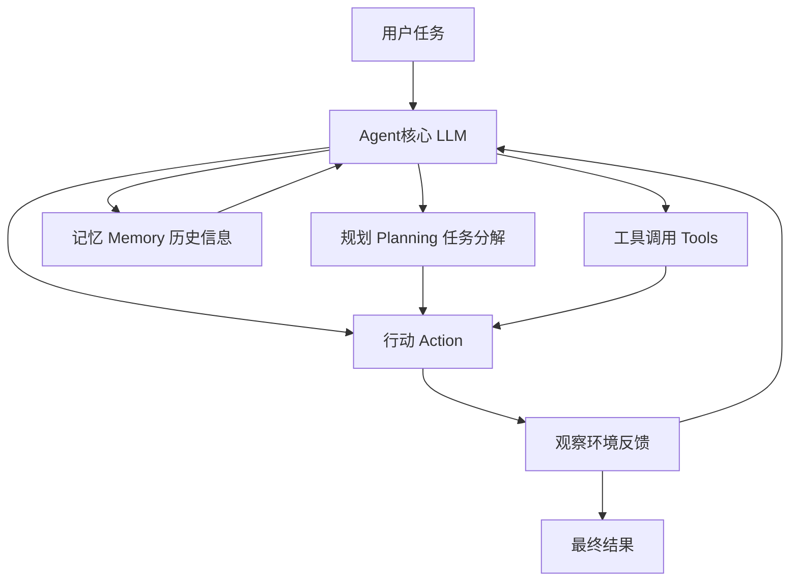

> **ReAct 框架**: 交替进行推理（Reasoning）和行动（Acting）——模型先推理下一步该做什么，再执行动作（如调用搜索工具），观察结果后继续推理，形成闭环。

### 4.5 Self-Instruct 自动指令生成

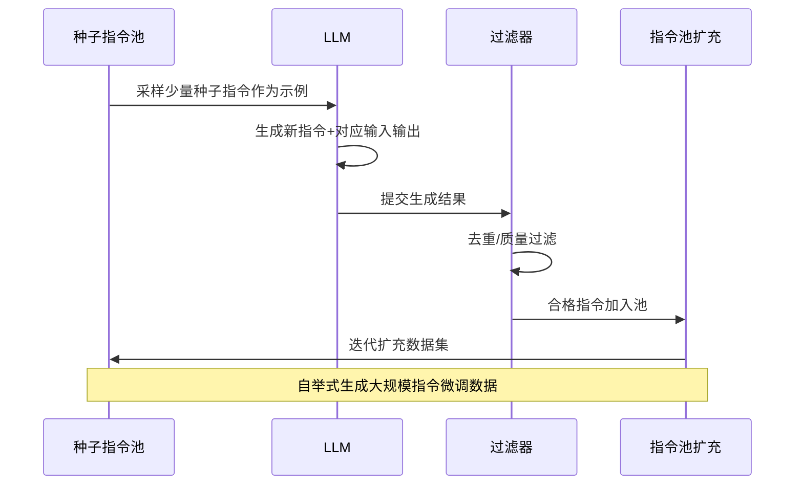

---

## 五、第4章 参数高效微调（PEFT）

### 5.1 PEFT 方法分类总览

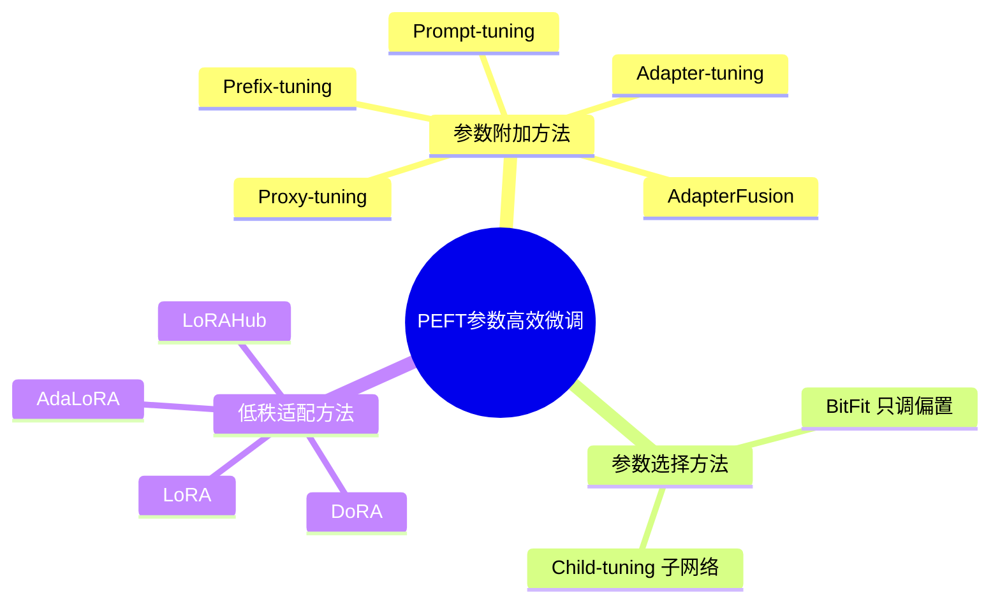

**PEFT 的核心动机**: 全参数微调大模型代价高昂（存储+计算）。PEFT 只训练少量参数（通常 <1%），即可达到接近全参微调的效果。

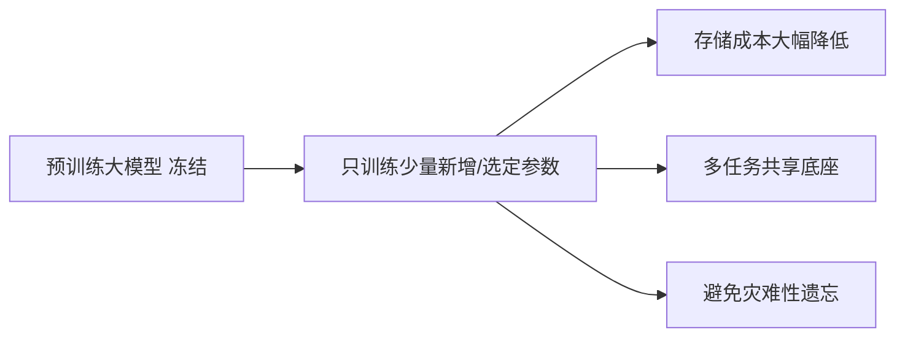

### 5.2 参数附加方法

**表4.1：参数附加方法对比**

| 方法 | 附加位置 | 核心思想 |
|---|---|---|
| Prompt-tuning | 输入嵌入层 | 添加可学习的软提示向量 |
| Prefix-tuning | 每层注意力的Key/Value前 | 添加可学习前缀 |
| Adapter-tuning | Transformer层内部 | 插入小型瓶颈适配器模块 |
| AdapterFusion | 多个Adapter之上 | 融合多任务Adapter知识 |
| Proxy-tuning | 输出logits层 | 用小模型调整大模型输出 |

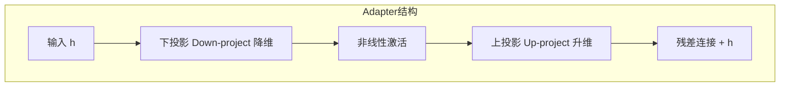

### 5.3 低秩适配（LoRA）— 全书重点

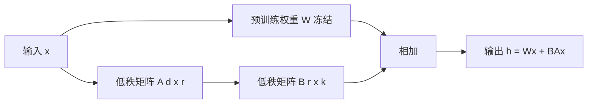

**LoRA 核心公式**：将权重更新 DeltaW 分解为两个低秩矩阵之积：

$$
h = W_0 x + \Delta W x = W_0 x + BA x
$$

其中 $B \in \mathbb{R}^{d \times r}$，$A \in \mathbb{R}^{r \times k}$，秩 $r \ll \min(d, k)$。

**表4.2：LoRA 系列方法对比**

| 方法 | 改进点 | 核心思想 |
|---|---|---|
| LoRA | 基础方法 | 低秩分解权重增量 |
| AdaLoRA | 自适应秩分配 | 按重要性动态分配各层的秩 |
| DoRA | 权重分解 | 将权重分解为幅度+方向分别适配 |
| LoRAHub | 多LoRA组合 | 动态组合多个LoRA模块跨任务泛化 |

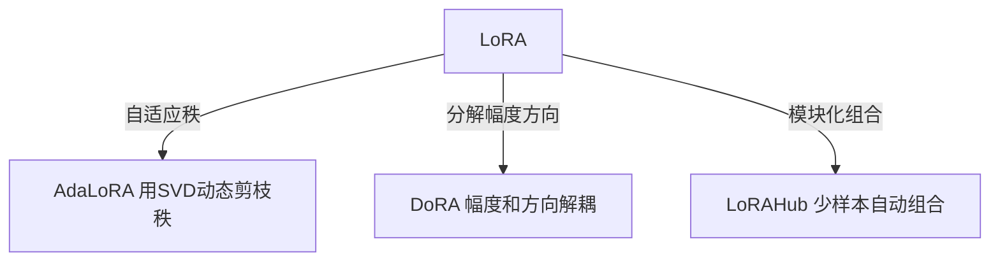

> **LoRA 的巨大优势**: 训练完成后，BA 可直接合并进 W0，**推理时零额外延迟**；一个底座模型可挂载多个 LoRA 适配器切换不同任务。

### 5.4 参数选择方法

- **BitFit**: 仅微调模型中的**偏置项（bias）**，参数量极少（约0.1%），却能在许多任务上接近全参微调。
- **Child-tuning**: 在反向传播时只更新一个**子网络（child network）**的参数，通过掩码控制梯度更新范围。

### 5.5 实践应用

**表4.3：PEFT 应用框架与案例**

| 名称 | 类型 | 说明 |
|---|---|---|
| HuggingFace PEFT | 框架 | 统一封装 LoRA/Prefix/Prompt 等方法 |
| FinSQL | 应用 | 金融领域 Text-to-SQL 的 PEFT 方案 |
| TabLLM | 应用 | 表格数据分类的少样本微调 |

---

## 六、第5章 模型编辑（Model Editing）

### 6.1 模型编辑的定义与五维评估

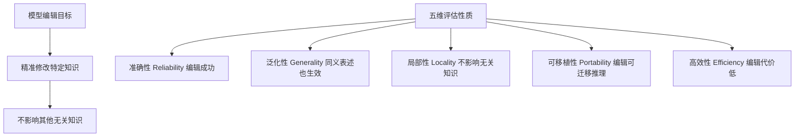

**表5.1：模型编辑五维评估指标**

| 性质 | 含义 | 检验方式 |
|---|---|---|
| 准确性(Reliability) | 目标编辑是否生效 | 编辑样本上的正确率 |
| 泛化性(Generality) | 同义改写是否也正确 | 释义样本上的正确率 |
| 局部性(Locality) | 无关知识是否保持不变 | 无关样本的输出一致性 |
| 可移植性(Portability) | 编辑后能否推理衍生知识 | 多跳推理样本正确率 |
| 高效性(Efficiency) | 时间/空间开销 | 编辑耗时与显存占用 |

### 6.2 模型编辑方法分类

```mermaid
mindmap
  root((模型编辑方法))
    外部拓展法
      知识缓存法
        SERAC
      附加参数法
        T-Patcher
        CaliNet
    内部修改法
      元学习法
        MEND
        KE
      定位编辑法
        ROME
        MEMIT
```

```mermaid
flowchart TD
    A[模型编辑] --> B[外部拓展法 不改原参数]
    A --> C[内部修改法 直接改参数]
    
    B --> B1[知识缓存法 额外存储编辑知识]
    B --> B2[附加参数法 增加少量新参数]
    
    C --> C1[元学习法 训练超网络预测参数更新]
    C --> C2[定位编辑法 定位知识位置精准修改]
```

### 6.3 T-Patcher（附加参数法代表）

```mermaid
flowchart LR
    A[定位补丁位置 最后一层FFN] --> B[补丁形式 添加神经元]
    B --> C[实现 每个错误添加一个补丁神经元]
    C --> D[仅在触发特定输入时激活]
```

> T-Patcher 在前馈网络（FFN）最后一层为每个需要修正的错误添加一个"补丁神经元"，该神经元仅在遇到对应错误输入时激活，实现精准局部修正。

### 6.4 ROME（Rank-One Model Editing）— 全书最精彩章节

ROME 通过"因果跟踪（Causal Tracing）"实验定位知识在模型中的存储位置，再进行精准的秩一编辑。

**因果跟踪三步实验（时序图还原）**：

```mermaid
sequenceDiagram
    participant C as 干净运行 Clean Run
    participant N as 破坏运行 Corrupted Run
    participant R as 恢复运行 Restoration Run
    
    C->>C: 正常输入"埃菲尔铁塔位于" 输出"巴黎"
    Note over C: 记录所有中间层隐藏状态
    N->>N: 给主语token加噪声 输出错误
    Note over N: 破坏主语表示，观察性能崩溃
    R->>R: 逐个恢复某层某位置的干净状态
    Note over R: 找出恢复后能挽救预测的关键层
    R-->>R: 定位到中间层FFN是知识存储关键
```

**表5.2：ROME 因果跟踪三种运行对比**

| 运行类型 | 操作 | 目的 |
|---|---|---|
| 干净运行(Clean) | 正常前向传播 | 记录基准隐藏状态 |
| 破坏运行(Corrupted) | 对主语token嵌入加噪声 | 破坏知识，观察输出崩溃 |
| 恢复运行(Restoration) | 逐层逐位置恢复干净状态 | 定位对预测起决定作用的层 |

**ROME 精准编辑三步骤**：

```mermaid
flowchart TD
    A[Step1 定位知识层] --> A1[因果跟踪确定中间层FFN]
    A1 --> B[Step2 计算键值对]
    B --> B1[将FFN视为键值存储器 k对应主语 v对应知识]
    B1 --> C[Step3 秩一更新]
    C --> C1[求解使新知识生效的最小权重扰动]
    C1 --> D[完成精准编辑 不影响无关知识]
```

> **核心洞察**: ROME 将 Transformer 的 FFN 层理解为**键值存储器（key-value memory）**——键对应主语的表示，值对应关联的事实知识。编辑知识 = 修改对应的键值映射，通过求解一个秩一（rank-one）约束优化问题实现。

### 6.5 模型编辑的应用

```mermaid
flowchart LR
    A[模型编辑应用] --> B[精准知识更新 修正过时事实]
    A --> C[被遗忘权 删除隐私信息]
    A --> D[祛除毒性 移除有害内容]
    A --> E[减弱偏见 消除歧视性关联]
```

---

## 七、第6章 检索增强生成（RAG）

### 7.1 RAG 基本架构

```mermaid
flowchart LR
    U[用户查询] --> R[检索器 Retriever]
    R --> K[(知识库)]
    K --> D[相关文档]
    D --> A[增强 拼接Prompt]
    U --> A
    A --> G[生成器 LLM]
    G --> O[最终答案]
```

**RAG 解决的核心问题——幻觉（Hallucination）**：

```mermaid
flowchart TD
    A[LLM幻觉成因] --> B[知识过时 训练数据有截止日期]
    A --> C[知识缺失 长尾/专业知识不足]
    A --> D[知识错误 训练数据噪声]
    
    E[RAG的解决方案] --> F[引入外部知识库]
    F --> G[实时/最新知识]
    F --> H[可追溯来源]
    F --> I[降低幻觉]
```

### 7.2 RAG 架构分类（原书重点）

```mermaid
flowchart TD
    A[RAG架构] --> B[黑盒增强 检索器/LLM参数不可见]
    A --> C[白盒增强 参数可训练]
    
    B --> B1[无微调 直接拼接检索结果]
    B --> B2[检索器微调 只训练检索器]
    
    C --> C1[仅微调LLM 适配检索内容]
    C --> C2[协同微调 检索器+LLM联合训练]
    
    B1 -.-> R1[简单 即插即用]
    C2 -.-> R2[性能最优 但计算成本高]
```

**表6.1：RAG 四种架构对比**

| 架构 | 检索器 | LLM | 优点 | 缺点 |
|---|---|---|---|---|
| 黑盒-无微调 | 冻结 | 冻结 | 即插即用 | 适配性差 |
| 黑盒-检索器微调 | 训练 | 冻结 | 检索更精准 | LLM未适配 |
| 白盒-仅微调LLM | 冻结 | 训练 | LLM会用检索内容 | 检索器未优化 |
| 白盒-协同微调 | 训练 | 训练 | 整体性能最优 | 计算资源消耗大 |

### 7.3 知识检索完整流程

```mermaid
flowchart LR
    U[用户查询] --> QE[查询增强]
    QE --> RT[检索器]
    KB[知识库构建] --> RT
    RT --> RR[检索结果重排]
    RR --> RES[最终结果]
    
    KB -.-> K1[数据采集预处理]
    KB -.-> K2[知识库增强]
    QE -.-> Q1[查询语义增强]
    QE -.-> Q2[查询内容增强]
```

#### 7.3.1 知识库构建

```mermaid
flowchart TD
    A[数据采集] --> B[数据预处理]
    B --> C[数据清洗 去特殊字符/去重]
    B --> D[文本分块 Chunking]
    D --> D1[适应上下文窗口]
    D --> D2[减少噪音]
    D --> D3[相邻块设置重叠区保持语义连贯]
    C --> E[知识库增强]
    D --> E
    E --> E1[查询生成 伪查询作为文档键]
    E --> E2[标题生成 为无标题文档生成标题]
```

#### 7.3.2 查询增强

**表6.2：查询增强方法**

| 类别 | 方法 | 示例（考拉案例） |
|---|---|---|
| 语义增强 | 同义改写 | "考拉吃什么" 变 "考拉的饮食结构如何" |
| 语义增强 | 多视角分解 | "考拉面临哪些威胁" 变 栖息地/气候/人类活动子问题 |
| 内容增强 | 生成背景文档 | 为查询生成一段考拉栖息地的背景知识 |

#### 7.3.3 检索器（稠密检索对比）

```mermaid
flowchart TD
    A[检索器] --> B[判别式检索器]
    A --> C[生成式检索器]
    
    B --> B1[稀疏检索器 TF-IDF/BM25]
    B --> B2[稠密检索器]
    B2 --> D[交叉编码器 Cross-Encoder]
    B2 --> E[双编码器 Bi-Encoder]
    
    C --> C1[直接生成文档标识符DocID T5/BART]
```

**交叉编码器 vs 双编码器（原书图6.15核心对比）**：

```mermaid
flowchart LR
    subgraph 交叉编码器
    A1[查询+文档拼接] --> A2[编码器BERT] --> A3[分类器] --> A4[相关性分数]
    end
    subgraph 双编码器
    B1[查询] --> B2[查询编码器] --> B3[向量u]
    C1[文档] --> C2[文档编码器] --> C3[向量v]
    B3 --> D[相似度计算] 
    C3 --> D
    D --> E[相关性分数]
    end
```

**表6.3：两类稠密检索器对比**

| 维度 | 交叉编码器 | 双编码器 |
|---|---|---|
| 交互方式 | 查询文档深度交互 | 各自独立编码 |
| 精度 | 高 | 相对较低 |
| 效率 | 低（每对都要重算） | 高（文档可离线预计算） |
| 适用阶段 | 精排（少量候选） | 粗排（大规模检索） |
| 代表方法 | — | DPR, ColBERT, Poly-encoder |

**TF-IDF 核心公式**（原书公式6.1-6.3）：

$$
tf_{i,j} = \frac{n_{i,j}}{\sum_k n_{k,j}}, \quad idf_i = \log\frac{|D|}{|\{j: t_i \in d_j\}|}, \quad tfidf_{i,j} = tf_{i,j} \times idf_i
$$

#### 7.3.4 检索效率增强（相似度索引算法）

```mermaid
flowchart TD
    A[相似度索引算法] --> B[空间划分法]
    A --> C[量化法]
    A --> D[图方法]
    
    B --> B1[基于树 KD树/Ball树]
    B --> B2[基于哈希 LSH局部敏感哈希]
    C --> C1[乘积量化PQ/OPQ/IVFPQ]
    D --> D1[NSW/HNSW 小世界网络]
```

**表6.4：常见向量数据库（原书表6.1还原）**

| 向量数据库 | GitHub Star | 特点 |
|---|---|---|
| Milvus | 28.4K | 功能全面，分布式 |
| Typesense | 19.0K | 轻量快速 |
| Qdrant | 18.9K | Rust实现，高性能 |
| Chroma | 13.7K | 轻量易用，适合原型 |
| Weaviate | 10.4K | 语义搜索强 |
| Pinecone | 商业闭源 | 云托管服务 |

> **Faiss（Meta AI）**: 并非完整数据库，而是专注于高效索引与搜索的工具库，支持 CPU/GPU 加速，涵盖空间划分/量化/图方法。

#### 7.3.5 检索结果重排

```mermaid
flowchart TD
    A[检索结果重排] --> B[基于交叉编码的方法]
    A --> C[基于上下文学习的方法]
    B --> B1[MiniLM 知识蒸馏轻量重排模型]
    C --> C1[RankGPT 用LLM排序 滑动窗口技术]
```

> **RankGPT** 使用精心设计的 Prompt 让 LLM 对文档按相关性排序，并采用**滑动窗口技术**处理超出上下文长度的大量文档——从文档集末尾开始，逐窗口排序并替换，向前滑动直至全部处理完毕。

### 7.4 生成增强（四大问题）

```mermaid
flowchart TD
    A[生成增强四大问题] --> B[何时增强 When]
    A --> C[何处增强 Where]
    A --> D[多次增强 Multi]
    A --> E[降本增效 Efficiency]
    
    B --> B1[非必要不增强 判断内部知识]
    C --> C1[输入端/中间层/输出端]
    D --> D1[分解式/渐进式]
    E --> E1[去冗余/复用KV-cache]
```

#### 7.4.1 何时增强

```mermaid
flowchart TD
    A[判断是否需要增强] --> B{模型是否具备内部知识}
    B -->|具备| C[不增强 避免错误增强+降低成本]
    B -->|不具备| D[检索增强]
    
    E[判断方法] --> F[外部观测法 无需模型参数]
    E --> G[内部观测法 需访问隐藏状态]
    
    F --> F1[直接询问模型]
    F --> F2[多次询问看一致性]
    F --> F3[观察训练数据/流行度]
    G --> G1[探针检测中间层隐藏状态]
```

> **经典反例（原书图6.17-6.18）**: 问"树袋熊在哪生活"，模型本可正确回答；但若强行提供"袋熊"（名称相近的不同动物）的外部知识，模型反而被误导给出错误答案——证明"非必要不增强"的重要性。

#### 7.4.2 何处增强

**表6.5：三种增强位置对比**

| 位置 | 方式 | 优点 | 缺点 |
|---|---|---|---|
| 输入端 | 检索文本拼接进Prompt | 直观易实现，主流方法 | 输入过长，推理成本高 |
| 中间层 | 交叉注意力融合向量(如Retro) | 深入影响内部表示，紧凑 | 需改模型结构，不适用黑盒 |
| 输出端 | 用检索知识校准输出(如REFEED) | 保证与外部知识一致 | 依赖检索质量 |

#### 7.4.3 多次增强

```mermaid
flowchart TD
    A[多次增强] --> B[分解式增强 处理复杂问题]
    A --> C[渐进式增强 处理模糊问题]
    
    B --> B1[DSP框架 Demonstrate-Search-Predict]
    C --> C1[ToC框架 Tree of Clarifications]
```

**DSP 框架流程（考拉案例）**：

```mermaid
sequenceDiagram
    participant D as DEMONSTRATE
    participant S as SEARCH
    participant P as PREDICT
    
    Note over D: 问题"睡眠最长的动物爱吃什么？"
    D->>D: 上下文学习分解为子问题
    D->>S: 子问题1"睡眠最长的动物是什么？"
    S->>S: 检索 确定是"考拉"
    S->>S: 形成子问题2"考拉爱吃什么？"
    S->>S: 再次检索 "桉树叶"
    S->>P: 提供综合外部知识
    P->>P: 综合生成最终答案
    Note over P: "考拉，爱吃桉树叶"
```

**ToC 框架**: 针对模糊问题"国宝动物爱吃什么"，递归式构建澄清树——中国国宝(熊猫 竹子)、澳洲国宝(考拉 桉树叶/袋鼠 杂草)，整合所有有效叶节点得到全面答案。

#### 7.4.4 降本增效

```mermaid
flowchart TD
    A[降本增效] --> B[去除冗余文本]
    A --> C[复用计算结果 KV-Cache]
    
    B --> B1[Token级 LongLLMLingua 困惑度筛选]
    B --> B2[子文本级 FIT-RAG 双标签打分]
    B --> B3[全文本级 PRCA 信息提取器]
    
    C --> C1[RAGCache 多级动态缓存]
```

**表6.6：去冗余方法三个粒度**

| 粒度 | 方法 | 核心思想 |
|---|---|---|
| Token级 | LongLLMLingua | 用小模型算困惑度，删除低信息Token |
| 子文本级 | FIT-RAG | 双标签打分器评估事实性+模型偏好 |
| 全文本级 | PRCA | 训练信息提取器端到端提炼重点 |

> **RAGCache（原书图6.26）**: 由 KV张量缓存库、缓存检索器、RAG控制器三部分组成，采用 PGDSF（前缀感知贪婪双重尺度频率）替换策略，复用高频文档的 KV-cache，显著降低重复计算。

### 7.5 RAG 实践与应用

```mermaid
flowchart LR
    A[RAG实践] --> B[开发框架]
    A --> C[典型应用]
    
    B --> B1[LangChain 全模块 六大组件]
    B --> B2[LlamaIndex 专注索引检索]
    
    C --> C1[智能体Agent 记忆/计划/行动融入RAG]
    C --> C2[多模态垂域 如医疗X光诊断]
```

**表6.7：LangChain vs LlamaIndex**

| 维度 | LangChain | LlamaIndex |
|---|---|---|
| 定位 | 全流程开发框架 | 专注数据索引与检索 |
| 核心模块 | Model IO/Retrieval/Chains/Memory/Agents/Callbacks | 数据连接器/索引/查询引擎 |
| 适用场景 | 复杂应用编排 | 高效检索/大数据量 |
| 关系 | 可与LlamaIndex结合使用 | 可作为LangChain的检索后端 |

**LangChain 搭建 RAG 五步骤**：

```mermaid
flowchart LR
    A[1.安装配置] --> B[2.数据加载 WebBaseLoader]
    B --> C[3.文本分割 RecursiveCharacterTextSplitter]
    C --> D[4.向量化索引 Chroma+OpenAIEmbeddings]
    D --> E[5.构建RAG链 检索器+Prompt+LLM]
```

---

## 八、核心概念交叉索引

| 概念 | 定义 | 章节 |
|---|---|---|
| 马尔可夫假设 | 当前词概率只依赖前n-1个词 | 1.1 |
| 自注意力 | 通过QKV计算序列内部关系 | 1.3 |
| 困惑度(PPL) | 语言模型预测不确定性度量 | 1.5 |
| 扩展法则 | 性能与规模的幂律关系 | 2.2 |
| 涌现能力 | 规模突破临界点后能力跃升 | 2.3 |
| 上下文学习(ICL) | 靠示例学习无需梯度更新 | 3.1 |
| 思维链(CoT) | 显式输出推理步骤 | 3.2 |
| LoRA | 低秩分解权重增量的PEFT方法 | 4.4 |
| 模型编辑 | 精准修改模型内特定知识 | 5.1 |
| 因果跟踪 | 定位知识存储层的实验方法 | 5.4 |
| RAG | 检索增强生成，引入外部知识 | 6.1 |
| KV-Cache | 缓存注意力Key/Value避免重算 | 6.4 |

---

## 九、全书重点金句摘录

> "语言模型的本质，是对自然语言序列的概率分布建模。" — 第1章

> "Transformer 用自注意力机制彻底改变了序列建模——它既能捕捉长距离依赖，又高度并行。" — 第1章

> "涌现能力是大模型区别于小模型的本质特征：它不是能力的平滑增长，而是相变式的跃升。" — 第2章

> "In-context Learning 让大模型无需微调即可适应新任务——这是提示工程的基石。" — 第3章

> "Let's think step by step——一句简单的咒语，就能激活大模型的推理能力。" — 第3章

> "参数高效微调的核心哲学：冻结绝大多数参数，只用极少的可训练参数撬动整个模型。" — 第4章

> "LoRA 的优雅之处在于：训练时低秩，推理时可合并，零额外延迟。" — 第4章

> "模型编辑追求的是外科手术式的精准——改对该改的，不动不该动的。" — 第5章

> "ROME 揭示了一个深刻洞察：Transformer 的前馈层其实是一个巨大的键值知识存储器。" — 第5章

> "检索的效果直接决定生成的质量——巧妇难为无米之炊。" — 第6章

> "非必要不增强：盲目引入外部知识，可能画蛇添足，反而降低质量。" — 第6章

> "RAG 让大模型从'闭卷考试'变成'开卷考试'，有效缓解幻觉。" — 第6章

> "考拉与袋熊的例子提醒我们：错误的检索比没有检索更危险。" — 第6章

---

## 十、疑难概念深度解析

### 10.1 为什么 Decoder-only 成为主流？

尽管 BERT（Encoder-only）在理解任务上曾一度领先，但 Decoder-only（GPT系列）凭借**自回归生成的统一性**——所有任务都可转化为"文本续写"——加上更好的扩展性和 In-context Learning 能力，最终成为大模型的主流选择。

### 10.2 LoRA 为什么有效？

核心假设：模型在适配下游任务时，权重更新 DeltaW 具有**低"内在秩"（intrinsic rank）**。即微调所需的变化其实存在于一个低维子空间中，因此可以用两个小矩阵 B x A 高效表达，无需更新整个大矩阵。

### 10.3 RAG vs 微调，如何选择？

| 维度 | RAG | 微调 |
|---|---|---|
| 知识更新 | 实时（换知识库即可） | 需重新训练 |
| 可解释性 | 高（可溯源） | 低 |
| 计算成本 | 推理时检索开销 | 训练时开销大 |
| 适用场景 | 知识密集/需实时更新 | 风格/能力定制 |

二者并非互斥，实践中常**结合使用**：用微调塑造能力与风格，用 RAG 注入实时知识。

---

## 十一、学习路径建议

```mermaid
gantt
    title 大模型基础学习进阶路线
    dateFormat  YYYY-MM-DD
    section 理论基础
    语言模型基础 Ch1      :a1, 2024-01-01, 3d
    LLM架构 Ch2          :a2, after a1, 2d
    section 应用技术
    Prompt工程 Ch3       :a3, after a2, 3d
    参数高效微调 Ch4      :a4, after a3, 3d
    section 前沿方向
    模型编辑 Ch5         :a5, after a4, 2d
    检索增强生成 Ch6      :a6, after a5, 4d
    section 实战
    搭建RAG系统            :a7, after a6, 3d
```

**阶段一（基础，5天）**: 精读第1-2章，吃透 Transformer 自注意力机制与三种架构差异，理解扩展法则与涌现能力。**动手**: 手推一遍自注意力公式。

**阶段二（应用，6天）**: 学第3-4章，掌握 CoT/ICL 提示技巧与 LoRA 微调。**动手**: 用 HuggingFace PEFT 跑一个 LoRA 微调实验。

**阶段三（前沿，6天）**: 学第5-6章，理解模型编辑（重点 ROME 因果跟踪）与 RAG 全流程。**动手**: 用 LangChain 搭一个简单 RAG 系统。

**检验标准**: 能独立设计一个"垂域知识问答系统"的技术方案（选架构 + 检索器 + 是否微调 + 是否 RAG）。

---

## 十二、全书一句话总结

> **《大模型基础》以"考拉"为线索，系统串起了大语言模型从底层架构（Transformer）到规模法则（Scaling Law/涌现），再到四大应用技术栈（Prompt工程、参数高效微调、模型编辑、检索增强生成）的完整知识地图——它回答的核心问题是：如何理解、定制、修正并增强一个大语言模型，使其在真实场景中精准、高效、可靠地工作。**

---

*生成时间: 2026-07-24 | 原书290页6章全量覆盖 | Mermaid图表 30+ 个 | 表格 20+ 张 | 公式 10+ 个*
*（内容由AI生成，仅供参考）*
