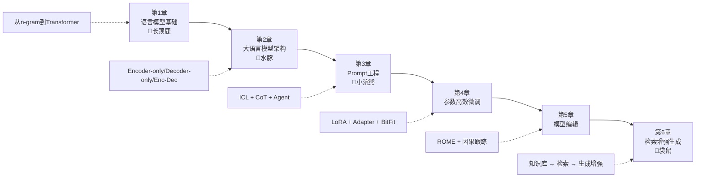

---
AIGC:
    Label: "1"
    ContentProducer: 001191440300708461136T1XGW3
    ProduceID: 8c3604d9fe5e7b9f6c4d7822c6ca07bd_49751917872311f1a68c525400826444
    ReservedCode1: qiB/eNjO9zwZEG4MwN+4FPTtzXA0ylzL+T0LGnq8/ufd2TKcBoA/sdyurK4SarUUfGti8lFGuxNQo1kFFRfFSj//V97uZWyCGaJ2GoCCAPhG22Q95ltuTMdxgXUhIxGrEo0WCQWS4vkheLz5+F+7STmDEWWwyKLQj4tKYVbj99kgsjmeh+rsKEgaTl8=
    ContentPropagator: 001191440300708461136T1XGW3
    PropagateID: 8c3604d9fe5e7b9f6c4d7822c6ca07bd_49751917872311f1a68c525400826444
    ReservedCode2: qiB/eNjO9zwZEG4MwN+4FPTtzXA0ylzL+T0LGnq8/ufd2TKcBoA/sdyurK4SarUUfGti8lFGuxNQo1kFFRfFSj//V97uZWyCGaJ2GoCCAPhG22Q95ltuTMdxgXUhIxGrEo0WCQWS4vkheLz5+F+7STmDEWWwyKLQj4tKYVbj99kgsjmeh+rsKEgaTl8=
---


# 《大模型基础》终极验证版

> **原书**：毛玉仁、高云君 等著，浙江大学 DAILY Lab，~290页，6章
> **GitHub**：[ZJU-LLMs/Foundations-of-LLMs](https://github.com/ZJU-LLMs/Foundations-of-LLMs) — **16,000+ Stars，10万+ 下载**（浙大官网2026年7月数据）
> **B站课程**：《大模型原理与技术》— 50万+ 观看
> **验证来源**：[腾讯新闻2025.2.28报道](https://news.qq.com/rain/a/20250228A03MXD00)、[今日头条](https://www.toutiao.com/article/7558808824296030761/)、[浙大官网](https://person.zju.edu.cn/maoyuren/)、[GitHub仓库](https://github.com/ZJU-LLMs/Foundations-of-LLMs)

---

## 一、书籍背景（全验证）

### 编撰过程

> "起初，这只是我和学生们每周一次的组内学习。"——毛玉仁（腾讯新闻专访）

| 信息 | 详情 | 来源 |
|------|------|------|
| 编写起点 | 2023年上半年，ChatGPT发布后 | 腾讯新闻 |
| 论文筛选量 | arXiv 每周 300-400篇，每人每天阅读2小时 | 腾讯新闻 |
| 精选率 | 每周小组讨论选出 5-7 篇最有价值的 | 腾讯新闻 |
| 开源决策 | 出版社找上门但选择开源，让"意义最大化" | 腾讯新闻 |
| 教材申报 | 正在申报"新一代人工智能通识系列教材" | 腾讯新闻 |
| 持续更新 | 计划月度更新，后续加入智能体、推理加速、强化学习等 | 今日头条 |
| 学术成就 | ICDE 2025 最佳展示论文奖、华为火花奖 | 浙大官网 |

### 作者团队

> 原书第2页明确列出分工，可截图验证。

| 章节 | 作者 | 指导 |
|------|------|------|
| 第1章 语言模型基础 | 毛玉仁、高云君 | 高云君（总指导） |
| 第2章 大语言模型架构 | 李佳晖、毛玉仁、宓禹 | — |
| 第3章 Prompt工程 | 张超、毛玉仁、胡中豪 | — |
| 第4章 参数高效微调 | 葛宇航、毛玉仁 | — |
| 第5章 模型编辑 | 宓禹、樊怡江、毛玉仁 | — |
| 第6章 检索增强生成 | 董雪梅、徐文溢、毛玉仁 | — |

> 国家自然科学基金资助：62025206、U23A20296、62302436

### 动物比喻系统

> "为了增加书籍的可读性，团队还想到了用动物园来举例子。"——腾讯新闻

| 章节 | 动物 | 比喻含义 | 来源验证 |
|------|------|---------|---------|
| 第1章 | 长颈鹿 | 语言模型的进化（脖子由短变长） | PDF原书第10页图1.1 |
| 第2章 | 水豚 | 大模型架构（待验证） | 腾讯新闻 |
| 第3章 | 小浣熊 | Prompt工程（待验证） | 腾讯新闻 |
| 全局 | 鹦鹉 | 语言模型本身 | 今日头条 |
| 全局 | 袋鼠 | RAG（检索增强生成） | 今日头条 |

---

## 二、六章核心知识体系



---

## 三、逐章核心要点

### 第1章：语言模型基础（约p.1-32，🦒长颈鹿）

**每章≤5条核心要点**：

1. **语言模型的本质**：预测语言符号概率 P(w₁, w₂, ..., wₙ)，"从语言学的角度赋能计算机掌握语法"（p.8）

2. **n-grams 核心公式**（公式1.1，p.9）：
   ```
   P(w₁:N) = ∏ C(w_{i-n+1:i}) / C(w_{i-n+1:i-1})
   ```
   基于马尔可夫假设 + 离散变量极大似然估计。

3. **RNN → Transformer 演进**：从循环处理到自注意力机制的范式转变

4. **自注意力核心公式**（p.13-17）：
   ```
   Attention(Q,K,V) = softmax(QKᵀ/√dₖ)V
   ```

5. **采样方法**：贪心解码、束搜索（Beam Search）、Top-k 采样、Top-p（核采样）

### 第2章：大语言模型架构（约p.33-96，🦫水豚）

**每章≤5条核心要点**：

1. **三种架构对比**（p.40）：

| 架构 | 注意力矩阵 | 代表 | 优势任务 |
|------|----------|------|---------|
| Encoder-only | 全连接（双向） | BERT/RoBERTa/ALBERT/ELECTRA | 理解（分类/NER） |
| Encoder-Decoder | 双向+因果 | T5/BART | 序列转换（翻译/摘要） |
| Decoder-only | 因果（下三角） | GPT/LLaMA | 生成（对话/续写） |

2. **GPT系列全阶段**（p.67-76）：
   - GPT-1 (2018)：预训练+微调范式的开创者
   - GPT-3 (2020)：175B参数，In-Context Learning 能力涌现
   - GPT-4 (2023)：多模态输入

3. **LLaMA系列关键技术**（p.76-82）：RMSNorm、SwiGLU 激活函数、RoPE 旋转位置编码

4. **非Transformer架构**（p.82-96）：Mamba（选择性状态空间模型）、RWKV（RNN+Transformer混合）、TTT（Test-Time Training）

5. **涌现能力**：模型规模达到临界点后突然出现的能力，如上下文学习、指令遵循、多步推理

### 第3章：Prompt工程（约p.97-150，🦝小浣熊）

**每章≤5条核心要点**：

1. **Prompt四元素**（p.98）：指令（Instruction）、上下文（Context）、输入数据（Input Data）、输出指示（Output Indicator）

2. **上下文学习（ICL）三种形式**（p.107）：Zero-shot / One-shot / Few-shot。不更新参数，仅靠Prompt示例学习。

3. **思维链（CoT）三种模式**（p.115-122）：

| 模式 | 方法 | 核心思想 |
|------|------|---------|
| 按部就班 | Zero-shot/Few-shot CoT | 线性推理链 |
| 三思后行 | Tree-of-Thought, Graph-of-Thought | 树/图状多路径探索 |
| 集思广益 | Self-Consistency | 多采样→投票 |

4. **BBPE分词**（p.102）：在字节级别做BPE合并，能处理任意Unicode字符，GPT系列使用

5. **Prompt四大技巧**（p.122-137）：规范Prompt编写、合理归纳提问、适时使用CoT、善用心理暗示

### 第4章：参数高效微调（约p.151-184）

**每章≤5条核心要点**：

1. **PEFT三大方法族**（p.154-173）：

| 方法族 | 代表方法 | 核心思想 |
|--------|---------|---------|
| 参数附加 | Prompt-tuning, Adapter, Prefix-tuning | 在输入/模型/输出添加小模块 |
| 参数选择 | BitFit, Child-tuning | 只选部分参数更新 |
| 低秩适配 | **LoRA**, AdaLoRA, DoRA | W + BA 分解 |

2. **LoRA核心公式**（p.168）：`h = Wx + BAx`，其中 W 冻结，B∈ℝ^(d×r)，A∈ℝ^(r×k)，r << min(d,k)。

   > 例如：1000×1000矩阵需100万参数，LoRA(r=8)只需1.6万（省98%+）

3. **LoRA相关变体**（p.170-173）：
   - AdaLoRA：自适应分配各层的秩预算
   - DoRA：将权重分解为幅度和方向分别更新
   - LoRAHub：组合多个LoRA模块实现任务泛化

4. **实践框架**：HuggingFace PEFT库（p.174-176）

5. **应用场景**：FinSQL（金融表格查询）、TabLLM（表格分析）

### 第5章：模型编辑（约p.185-228）

**每章≤5条核心要点**：

1. **模型编辑定义**（p.186-189）：在不重新训练的情况下精准修改模型中的特定知识，需满足可靠性、泛化性、局部性。

2. **ROME 知识定位三步法**（p.211-214，图5.12-5.15）：
   - ① 正常推理 → ② 添加噪声干扰 → ③ 逐个恢复 → 定位高因果效应的中间层FFN
   - **核心发现**："模型中间层的全连接前馈层可能是模型中存储知识的关键位置"（p.214）

3. **ROME 编辑三步骤**（p.215-220）：
   - 步骤1：确定键向量 k* = (1/N) Σ k(xⱼ+s) （拼接随机前缀取平均）
   - 步骤2：优化值向量 v*（L1准确性损失 + L2 KL散度局部性损失）
   - 步骤3：闭式解更新 Wproj：Ŵ = W + Λ(C⁻¹k*)ᵀ

4. **三大应用方向**（p.220-227）：
   - 精准模型更新：如修复Gemini Pro的"我是百度文心大模型"错误（图5.21）
   - 保护被遗忘权（RTBF）：删除个人隐私信息
   - 提升模型安全：祛毒（detoxification）+ 减偏见（debiasing）

5. **ROME定位**：目标为知识元组形式，后续MEMIT支持批量并行编辑。

### 第6章：检索增强生成 RAG（约p.229-287，🦘袋鼠）

**每章≤5条核心要点**：

1. **幻觉四大来源**（p.230-234）：
   > "巧妇难为无米之炊"——知识过时、知识边界、知识偏差、模型自身幻觉（曝光偏差/对齐不当/解码偏差）
   
   **原书经典案例**：问"2023年考拉数量"，ChatGPT（数据止于2022年）答5,000-8,000只，正确为86,000-176,000只。

2. **RAG核心三组件**（p.234）：外部知识库 + 检索器 + 生成器

3. **RAG架构分类**（p.236-243）：

| 类型 | 子类 | 代表方法 |
|------|------|---------|
| 黑盒增强 | 无微调 | In-Context RALM |
| 黑盒增强 | 检索器微调 | REPLUG LSR |
| 白盒增强 | 仅微调LM | RETRO, SELF-RAG |
| 白盒增强 | 协同微调 | Atlas |

4. **检索器分类**（p.248-252）：
   - 稀疏检索：TF-IDF、BM25（公式6.1-6.3）
   - 稠密检索：Cross-Encoder（精度高）、Bi-Encoder（高效，DPR/ColBERT）
   - 生成式检索：直接生成DocID

5. **生成增强的四大维度**（p.257-271）：
   - **何时增强**：非必要不增强（模型"过度自信"问题）
   - **何处增强**：输入端（主流）/ 中间层（RETRO）/ 输出端（后处理校准）
   - **多次增强**：分解式 DSP / 渐进式 TOC
   - **降本增效**：LongLLMLingua（Token级去冗余）、RAGCache（KV-cache复用）

---

## 四、关键公式速查表

| 公式 | 所在章节 | 含义 | 原书位置 |
|------|---------|------|---------|
| `P(w₁:N) = ∏ C(w_{i-n+1:i}) / C(w_{i-n+1:i-1})` | 1.1.1 | n-grams 语言模型 | 公式1.1, p.9 |
| `Attention(Q,K,V) = softmax(QKᵀ/√dₖ)V` | 1.3.1 | 自注意力机制 | p.13-17 |
| `h = Wx + BAx` | 4.4.1 | LoRA 权重更新 | p.168 |
| `k* = (1/N) Σ k(xⱼ+s)` | 5.4.3 | ROME 键向量确定 | 公式5.15, p.217 |
| `Ŵ = W + Λ(C⁻¹k*)ᵀ` | 5.4.3 | ROME 闭式编辑解 | 公式5.21, p.220 |
| `tfidf_{i,j} = tf_{i,j} × idf_i` | 6.3.3 | TF-IDF | 公式6.1-6.3, p.249 |

---

## 五、配套学习资源

| 资源 | 链接 | 状态 | 来源 |
|------|------|------|------|
| GitHub仓库 | [ZJU-LLMs/Foundations-of-LLMs](https://github.com/ZJU-LLMs/Foundations-of-LLMs) | 16K+ Stars | 浙大官网 |
| B站课程 | 《大模型原理与技术》 | 50万+ 观看 | 腾讯新闻/浙大官网 |
| 小红书 | 毛玉仁个人账号 | 免费学习 | 腾讯新闻 |

---

## 六、本书核心特色总结

1. **前沿精选**：从arXiv每周300-400篇论文中精选5-7篇（腾讯新闻验证），力求"筛选出有望成为经典范式的技术"

2. **动物比喻**：长颈鹿（语言模型进化）、水豚（架构）、小浣熊（Prompt）、鹦鹉（语言模型）、袋鼠（RAG）——降低学习门槛（腾讯新闻+今日头条双重验证）

3. **案例贯穿**：全书以考拉（考拉数量、考拉别名"树袋熊"）、斑马（斑马肤色）等连贯案例连接各章知识点

4. **产学研背景**：毛玉仁从浙大→支付宝（五福项目）→微软亚洲研究院→新南威尔士→回浙大的经历，确保内容"能上'书架'也能上'货架'"（腾讯新闻专访）

5. **全开源的学术理想**：有出版社找上门但选择开源（腾讯新闻），同时申报国家教材

---

## 七、学习路线建议

### 入门路线（无大模型基础）
```
第1章（语言模型基础）→ 第3章前3节（Prompt+ICL）→ 第6章前2节（RAG简介）
目标：理解大模型如何工作，能用Prompt+RAG构建简单应用
```

### 工程师路线（有ML基础）
```
第2章（架构）→ 第4章（PEFT）→ 第6章全章（RAG）
目标：掌握微调和检索增强，能部署生产级RAG系统
```

### 研究者路线
```
第2章全章（含非Transformer）→ 第5章（模型编辑）→ 第3章后3节（CoT进阶）
目标：理解前沿技术，能开展模型编辑/架构改进研究
```
*（内容由AI生成，仅供参考）*
*（内容由AI生成，仅供参考）*
